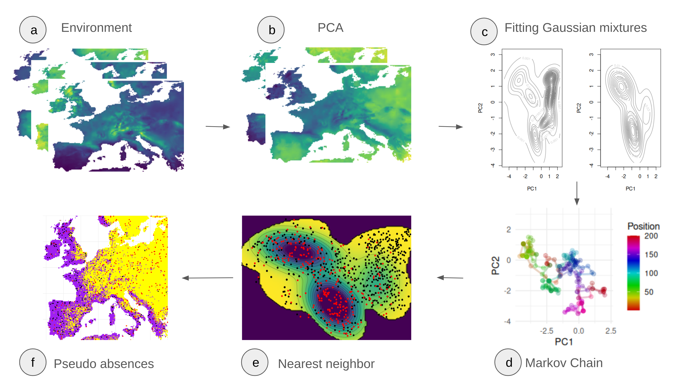

Development Repository
================
# TLDR
We can use markov chains to sample pseudo absences in moderate dimensions. In the process we overcome limitations of the original paper, especially those related to a sampling grid, only two dimensions in the PCA space, and the hard cutoff threshold to exclude the presence species. The figure below shows an overview of the proposed method.

# This is a development repository
It forks the [USE package](https://github.com/danddr/USE) with the goal to extend it to enable MCMC sampling in higher
dimensional spaces.
The repo can be downloaded by using the following command in a terminal or downloading the repo as a zip file:

git clone https://github.com/Mdmdma/USE.MCMC.git

The vignette [Insights on Markov chain based pseudo-absence sampling](https://mdmdma.github.io/USE.MCMC/articles/insights-on-MCMC-pseudo-absence-sampling-vignette.html) gives insights into the developed method, the vignette [Insights on nearest neighbor search](https://mdmdma.github.io/USE.MCMC/articles/Insights-on-nearest-neighbor-search.html) adds an explainer to the concept of using distance in the principal component space as a way to map fictional simulated points to real points in the environment. Both vignettes can be found on the GitHub Pages site.
# Basic principle and result
We fit Gaussian mixture models (GMMs) to both the points of the environment and the model species in the PCA space of their environmental variables. From these GMMs we construct a function on which we run a markov chain. The figure below displays the sampled function, the sample species points as well as the sampled points in the space spanned by the first two principle components. 

We can show the sampled points in the geographic space. 

Looking at the density of the pc scores, we can see that our newly developed method enables the user to sample more dimensions uniformly. If this is beneficial to the downstream model depends on the amount of variability explained by the first two components. 

