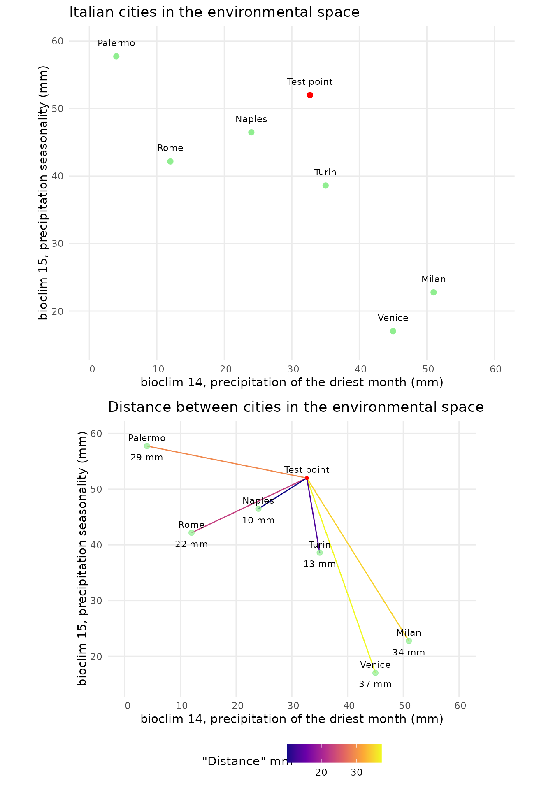
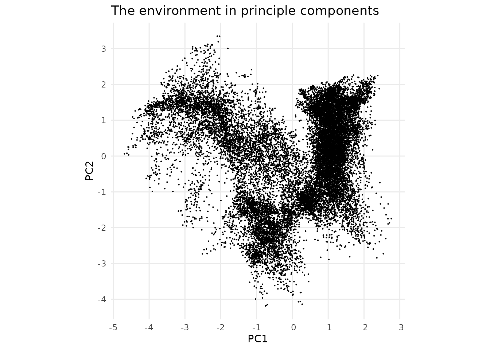
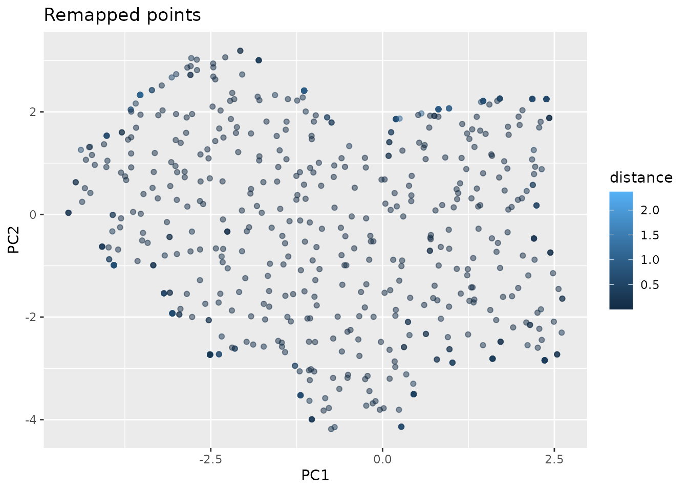
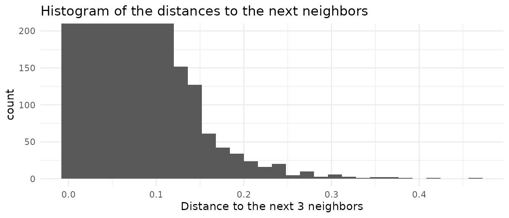
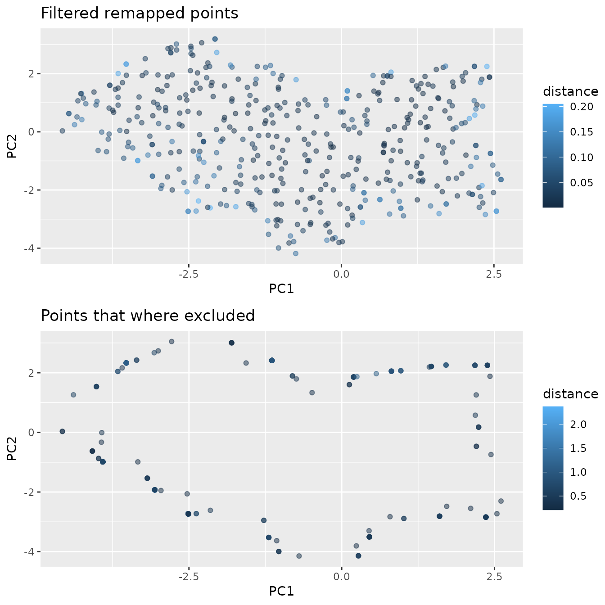

# Insights on nearest neighbor search

This vignette gives some insights on the concept of nearest neighbor
search in the context of uniform sampling.

``` r
library(USE.MCMC)
library(ggplot2)
library(rnaturalearth)
library(rnaturalearthdata)
library(FNN)
library(sf)
library(dplyr)
library(cowplot)
library(virtualspecies)
```

The foundation of the approach is the assumption that we can map a point
in various dimensions to real points in our environment using distance
as the metric that tells us which point matches best.

In the geographical space this concept is very intuitive. The closest
city to a given test point is the one with the least distance.


In this case Venice is closest to the test point. If we want to get a
real point from our test point using geographical distance as out metric
we would therefore choose Venice.

We can now do the same thing in the environmental space. To start lets
build an example with just two dimensions. As an example we can look at
bioclimatical variables 14 and 15. Bioclim 14 denotes the precipitation
of the driest month, bioclim 15 the precipitation seasonality.



Now Naples is the closest location. In this case the term distance is
still somewhat sound, as both axis have the units mm. It starts to fall
apart when axis to not share the same units, as is unclear how the
scales of the data compare. In this fabricated case, dimensions of
similar scale were chosen, but this is not necessarily the case. As an
example bioclim 4 has values ranging between 200 and 900 in Europe. How
these variables are scaled to get meaningful results is not clear. One
way to evade this issue is to perform a PCA. In this case the different
scales of the axis are explained by the respective variability that can
be explained with the axis. The unit of the “distance” loses its
interpretability, as it will be a mix between temperature and
precipitation. Non the less we can find environmentally similar points
by selecting the point with the shortest distance to our test points.

Lets look at a example of our test points when performing a principle
component analysis on five bioclim variables(3, 4, 9, 14, 15).

``` r
set.seed(42)
rpc <- rastPCA(env.data.raster,  stand = TRUE)
env.data.raster.with.pc <- c(rpc$PCs , env.data.raster)
```


Looking at the first two principal components we see that the test point
is climate wise closest to Turin, while still being far. In addition we
see that the distance to Naples, Milan and Venice is not much higher.
The distance gives us a indication on how similar the best match is. In
this case it would probably be sound to say that no good match was
found. As our environmental space only contained 7 points this is no
surprise. Luckily for us there are more then seven measurement stations
in Europe and satellites can provide high resolution data for areas
without measurement devices on the ground. At a resolution of 2.5 arc
minutes there are over 18’000 data points in western Europe.

``` r
dimensions <- c("PC1", "PC2")
env.data.sf <- env.data.raster %>%
  as.data.frame(xy = TRUE) %>%
  sf::st_as_sf(coords = c("x", "y"))

env.data<- env.data.raster %>%
  as.data.frame(xy = TRUE)

env.with.pc <- rpc$PCs  %>%
  as.data.frame(env.with.pc, xy = TRUE) %>%
  na.omit() %>%
  cbind(env.data.sf)

env.with.pc.sf <- sf::st_as_sf(env.with.pc, coords = dimensions)
```


Now lets explore how we can use the nearest neighbor mapping can help us
to uniformly sample points out of this environmental space.

If we would randomly pick points out of the set of points in the
environment we would recreate the distribution of points in the
environment and not get a flat, uniform, distribution.

The main principle of the proposed method is that we create a grid of
uniformly spaced points, map them back to real points in the environment
and then use statistics of the distances to exclude points that had
their origin in a region that was too far away from the real points.
This works with the assumption that the environment is made up by
connected points.

The function
\[[`paSamplingNn()`](https://mdmdma.github.io/USE.MCMC/reference/paSamplingNn.md)\]\[USE.MCMC::paSamplingNn\]
performs this sampling given the environmental space. Lets look under
its hood to understand how it works.

In a first step we need to provide the parameters we want to control.

``` r
grid.res <- 15
num.samples.per.cell <- 3
dimensions <- c("PC1", "PC2")
```

We now compute a uniformly spaced grid that covers the whole
environmental range.

``` r
# compute the grid cells
grid <- sf::st_make_grid(env.with.pc.sf, n = c(grid.res)) %>%
  sf::st_centroid() %>%
  sf::st_coordinates() %>%
  as.data.frame()
names(grid) = dimensions
```


As we may want multiple points sampled from the same grid cell, we
repeat the grid the respective number of times.

``` r
grid.repeated <- do.call(rbind, replicate(num.samples.per.cell,
                                          grid,
                                          simplify = FALSE))
```

So far this would does not work, these repeated points would all map to
the same nearest neighbor in the environment. In addition to that the
grid adds a bias to the sampled points.

To eliminate this issue we add uniform noise in the range of the grid
spacing to the points. Thereby we loose the grid bias, and sample from
random location in each grid cell, while on larger scales still
conserving uniform sampling. In addition to that we can now sample
multiple points from the same grid cell, as the noise is different for
each point.

``` r
step.scaling = 2
step.x <- (grid[1,2] - grid[1,1]) / step.scaling
step.y <- (grid[2,1] - grid[1,1]) / step.scaling

noise.x <- stats::runif(nrow(grid.repeated), -step.x, step.x)
noise.y <- stats::runif(nrow(grid.repeated), -step.y, step.y)
noise <- data.frame(noise.y, noise.x)
grid.noisy <- grid.repeated + noise
```


We have reached the main concept of this approach. So far the points on
the grid are not present in the real dataset. For each point in the
repeated noisy grid we search the closest neighbor in the real
environmental space. This is implement with the FNN package. By using a
KD-tree, it can handle large data sets in higher dimensions quickly.

``` r
mapped.sampled.point.data <- FNN::get.knnx(env.with.pc[dimensions], 
                                           grid.noisy, k = 1)
mapped.sampled.points <- env.with.pc[mapped.sampled.point.data$nn.index,]
mapped.sampled.points$distance <- mapped.sampled.point.data$nn.dist
```



Now we have points distributed nearly uniformely in the environment. The
issue remaining is that we oversampled the border regions, as even cells
that did not contain any points where remapped to the closest point,
even if that point was in a different grid cell. We now have different
options on how to set the distance threshold at which we denote points
to have originated too far away.

One option is to use the cell size as the limiting factor. By setting
the distance threshold to be halve the cell size, we can eliminate
points that where sampled in empty cells. This approach depends on
having chosen the cell size well. We can look at the limits.

If we set the grid size to one, we only have one cell. The distance
threshold would be very large, we would not remove any points and
oversample the border regions.

On the other hand if the cell size is too small, the threshold will be
very small. In the areas with low point densities there will be a lot of
points where the distance to the next point is too large. On first look
this is no issue, as these points stem from “empty” grid sells. The
issue emerges in areas with a high point density. Here there will be no
empty cells. Thus at the low limit these areas will be oversampled.

``` r
distance.threshold <- max(step.y, step.x) / 2
mapped.sampled.points.filtered <- mapped.sampled.points[
  mapped.sampled.points$distance < distance.threshold, ]
```

Luckly we have additional information. The original dataset itself gives
us some indication what kind of distances are normal. By searching the
closest few, but at least more then number of points per gridcell,
neighbors, we can compute a histogramm of the distance between points in
the original data

``` r
nearest.neighbors.distance<- FNN::knn.dist(env.with.pc[dimensions],
                                           k=num.samples.per.cell) %>%
  as.vector()
```


We see that the distance histogram is dominated by the low distances
originating in regions with high densities. If we look at the top end on
the other hand, we get information on the spacing of areas with a low
point density. We probably do not want to take the maximal distance as
our threshold, as the dataset could contain outlayers. We can sort the
the vector containing the distances and take a value with some safty
threshold from the extreme values.

``` r
sorted.nearest.neighbor.distances <- sort(nearest.neighbors.distance, 
                                          decreasing=TRUE)
distance.threshold <- sorted.nearest.neighbor.distances[2] / 2

mapped.sampled.points.filtered <- mapped.sampled.points[
  mapped.sampled.points$distance < distance.threshold, ]
```



It can still happen that we map two sampled points to the same real
point. These points should be removed, as they do not provide additional
information. The probability to map twice to the same point is
correlated the the distance threshold. Especially at the borders of the
environment the probability to map twice to the same point its high, as
there is only one direction in which a neighbor can lay, in difference
to points inside of the environment for which two directions in which a
nearest neighbor can be found. This leads to some oversampling. It is
not trivial how to eliminate this issue.

``` r
mapped.sampled.points.filtered.unique <- mapped.sampled.points.filtered[
  !duplicated(mapped.sampled.points.filtered[["PC1"]]), ]
```


We can see that the chosen threshold is reasonable, as it reduces the
oversampling in border regions well without removing points in areas
that we think to be part of the environment.

This threshold method can also be used to estimate a upper bound to the
useful grid resolution. A function that provides this functionality is
given by \[`maxresNn()`\]\[USE.MCMC::maxResNn\].

In difference to the original
\[[`paSampling()`](https://mdmdma.github.io/USE.MCMC/reference/paSampling.md)\]\[USE.MCMC::paSampling\]
method this approach should still converge to uniform sampling for too
low grid resolutions. The issue here is that it can not be the
guaranteed that the distribution is flat for small sample sizes. The
deviations from uniform sampling are not expected to be at the same
position as the high point density areas of the underlying distribution

From here we can use the same approach as in the original method to
exclude points that have properties that coincide with the presence
species.

We can generate a sample species:

``` r
virtual.presence.data <- getVirtualSpeciesPresencePoints(
  env.data = env.data.raster, n.samples = 300)
#> [1] 300
virtual.presence.points <- virtual.presence.data$sample.points
```

``` r
occ.vec <- virtual.presence.points
thres = 0.7
id_rast <- terra::rast(vals= 1:terra::ncell(env.data.raster),
                       names ="myID",
                       extent = terra::ext(env.data.raster),
                       nrows = terra::nrow(env.data.raster),
                       ncols = terra::ncol(env.data.raster),
                       crs = terra::crs(env.data.raster)
)
abio.st <- terra::as.data.frame(c(id_rast, env.data.raster))
dt <- terra::as.data.frame(c(id_rast, rpc$PCs[[c("PC1", "PC2")]]), xy = TRUE)
PC12occ <- terra::extract(id_rast,  occ.vec, cells = FALSE,
                          df = FALSE, ID=FALSE)[,1]
PC12ex <- na.omit(data.frame(dt, PA= ifelse(dt$myID %in% PC12occ, 1, 0)))

H <- ks::Hpi(x = PC12ex[, c("PC1", "PC2")])

estimate <- data.frame(KDE = ks::kde(PC12ex[PC12ex$PA == 1, c("PC1", "PC2")],
                                     eval.points = PC12ex[PC12ex$PA ==1,
                                                          c("PC1", "PC2")],
                                     h = H)$estimate,
                       PC12ex[PC12ex$PA == 1, c("PC1", "PC2", "myID", "PA")])

quantP <- quantile(estimate[, "KDE"], thres)
estimate$percP <- ifelse(estimate$KDE <= unname(quantP[1]), "out", "in")
point.data <- merge(x = PC12ex, 
                    y = estimate[estimate$PA == 1,c("myID","percP")],
                  by = "myID", all.x = TRUE)
point.data$percP <- ifelse(is.na(point.data$percP), "pabs",point.data$percP)
chull <- sf::st_as_sf(subset(point.data, point.data$percP=="in", 
                             select=c( "PC1","PC2" )),
                      coords=c( "PC1","PC2" ))
chull <- sf::st_union(chull)
chull <- sf::st_convex_hull(chull)
point.data.sf <- sf::st_as_sf(mapped.sampled.points.filtered.unique,
                              coords=c( "PC1","PC2" ))
outside.the.region.with.presence <- point.data.sf[!sf::st_within(point.data.sf,
                               chull, sparse = FALSE), ]

# Reorganize the columns of the sf object so that the output is more convenient
sampled.points.absence <- sf::st_coordinates(outside.the.region.with.presence)
colnames(sampled.points.absence) <- c("PC1", "PC2")
sampled.points.without.points.not.assosiated.with.the.species <- cbind(
  sf::st_drop_geometry(outside.the.region.with.presence),
  sampled.points.absence)
```

``` r
virtual.presence.points.pc <- terra::extract(env.data.raster.with.pc,
                                             virtual.presence.points,
                                             bind = TRUE) %>%
  sf::st_as_sf()
virtual.presence.points.pc$type <- "Presence"
virtual.presence.points.pc <- sf::st_set_crs(virtual.presence.points.pc, "")
```


We can also plot the plots in the real geographical space.


We can see that the points that where uniformly sampled in the
environmental space are not evenly spaced any more. Areas with large
environmental gradients get sampled more often.
