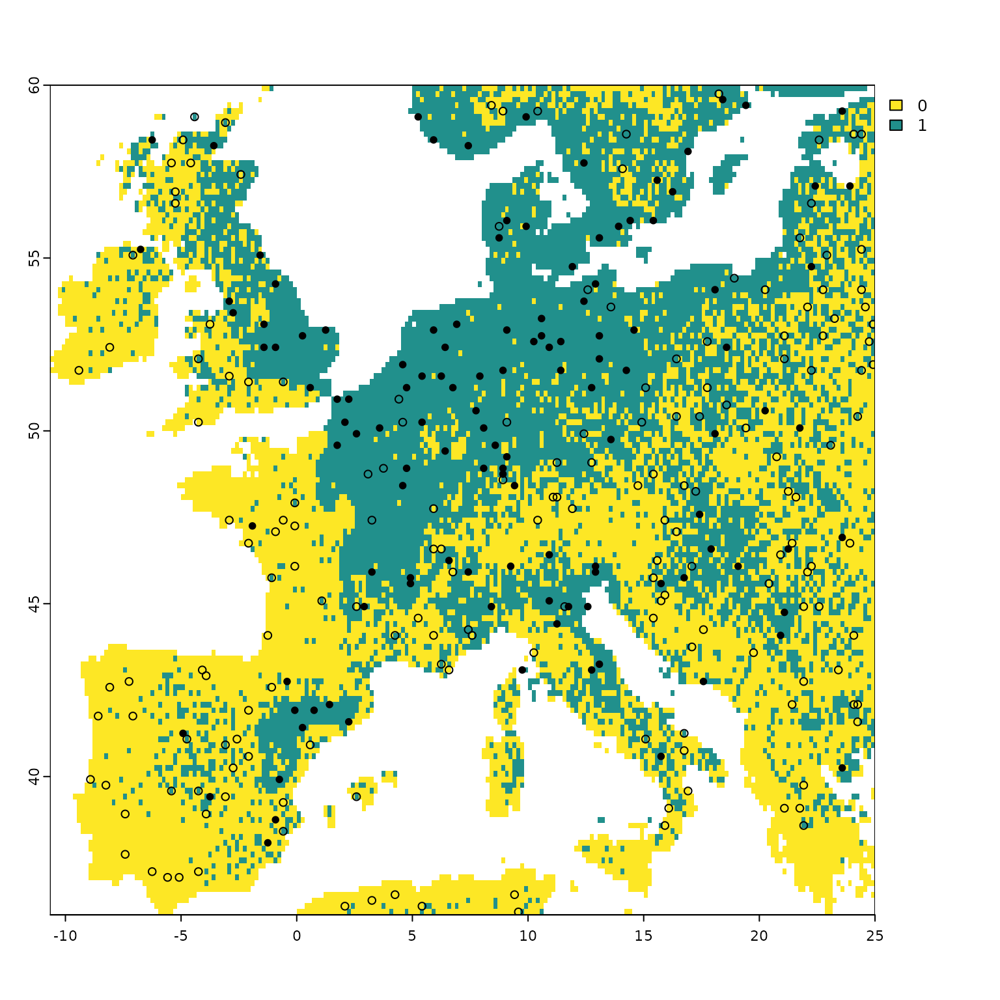
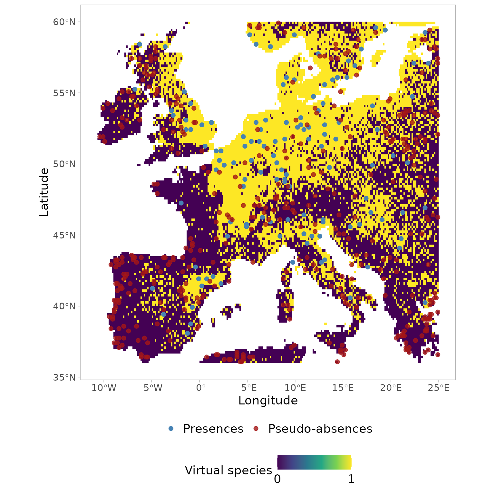

# USE vignette

This vignette shows the different functionalities, as well as related
practical examples, of the `USE` package.

``` r
library(USE.MCMC)
library(terra)
library(virtualspecies)
library(sf)
library(ggplot2)
```

``` r
dataDir <- getwd()
Worldclim <- geodata::worldclim_global(var = 'bio', res = 2.5, path = dataDir)
names(Worldclim) <- paste0("bio", 1:length(names(Worldclim)))
```

## 1. Create Virtual Species

First, download the bioclimatic variables from WorldClim and crop them
to the European extent.

``` r
Worldclim <- geodata::worldclim_global(var='bio', res=10, path=getwd()) 
envData <- terra::crop(Worldclim, terra::ext(-12, 25, 36, 60))
```

Then, generate a virtual species using the bioclimatic variables
downloaded in the previous step. For details about the methodology used
to create a virtual species, see the
[vignette](http://borisleroy.com/files/virtualspecies-tutorial.html#introduction)
of the `virtualspecies` R package.

``` r
#create virtual species
myRandNum <- sample(1:19,size=5, replace = FALSE)
envData <- envData[[myRandNum]]
```

``` r
set.seed(123)
random.sp <- virtualspecies::generateRandomSp(envData, 
                                              convert.to.PA = FALSE, 
                                              species.type = "additive",
                                              realistic.sp = TRUE, 
                                              plot = FALSE)
#reclassify suitability raster using a probability conversion rule
new.pres <- virtualspecies::convertToPA(x=random.sp, 
                      beta=0.55,
                      alpha = -0.05, plot = FALSE)
#Sample true occurrences
presence.points <- virtualspecies::sampleOccurrences(new.pres,
                                     n = 300, # The number of points to sample
                                     type = "presence-absence",
                                     sample.prevalence = 0.6,
                                     detection.probability = 1,
                                     correct.by.suitability = TRUE,
                                     plot = TRUE)  
```



Generate a presence-only data set.

``` r
myPres <- presence.points$sample.points[which(presence.points$sample.points$Observed==1), c( "x", "y",  "Observed")]
myPres <- st_as_sf(myPres, coords=c("x", "y"), crs=4326)
```

## 2. Generating the environmental space

First, the environmental space is generated by performing a principal
component analysis (PCA) on a raster stack that includes the selected
spatial environmental layers (such as precipitation and temperature). In
practice, the PCA operates on the values of the environmental conditions
linked to the pixels of the spatial environmental layers. Next, the
first two principal components are extracted from the PCA to create a
two-dimensional environmental space (it’s important to note that the
current version of USE only supports uniform sampling in two
dimensions).

Once the two principal components are obtained, a new “spatial object”
is created, with the PC-scores (which represent the projection of the
environmental pixels within the two-dimensional space) serving as the
object’s coordinates. This object is then scanned systematically to
gather pseudo-absences. It’s worth mentioning that, at this stage, all
PC-scores, except those associated with the presence of the virtual
species, are considered potential pseudo-absences.

The function
[`USE.MCMC::optimRes`](https://mdmdma.github.io/USE.MCMC/reference/optimRes.md)
can be used to find the optimal resolution (i.e., the one providing the
best trade-off between a fine resolution and the overfitting of the
environmental space) of the sampling grid that will be used to collect
the pseudo-absences within the environmental space (see below).

``` r
rpc <- rastPCA(envData, stand = TRUE)
dt <- na.omit(as.data.frame(rpc$PCs[[c("PC1", "PC2")]], xy = TRUE))
dt <- sf::st_as_sf(dt, coords = c("PC1", "PC2"))
```

``` r
myRes <- USE.MCMC::optimRes(sdf=dt,
                    grid.res=c(1:10),
                    perc.thr = 20,
                    showOpt = TRUE, 
                    cr=5)
```


``` r
myRes$Opt_res
```

    ## [1] 5

## 3. Uniform sampling of the environmental space

To provide a clear example, the function
[`USE.MCMC::uniformSampling`](https://mdmdma.github.io/USE.MCMC/reference/uniformSampling.md)
is utilized below to systematically search through the environmental
space and gather a specific number of observations from each cell within
the sampling grid. The resolution of this grid was determined beforehand
using the
[`USE.MCMC::optimRes`](https://mdmdma.github.io/USE.MCMC/reference/optimRes.md)
function. It’s important to note that in the given example, both the
presences and pseudo-absences of the virtual species are potentially
sampled by the
[`USE.MCMC::uniformSampling`](https://mdmdma.github.io/USE.MCMC/reference/uniformSampling.md)
function, as the main purpose is to demonstrate its operation. In the
subsequent section, the
[`USE.MCMC::uniformSampling`](https://mdmdma.github.io/USE.MCMC/reference/uniformSampling.md)
function will be internally called by
[`USE.MCMC::paSampling`](https://mdmdma.github.io/USE.MCMC/reference/paSampling.md),
exclusively focusing on sampling pseudo-absences.

``` r
myObs <- USE.MCMC::uniformSampling(sdf=dt, 
                              grid.res=myRes$Opt_res,
                              n.tr = 5,
                              sub.ts = TRUE,
                              n.ts = 2,
                              plot_proc = FALSE)
```

    ## Simple feature collection with 18953 features and 3 fields
    ## Geometry type: POINT
    ## Dimension:     XY
    ## Bounding box:  xmin: -4.687449 ymin: -4.183169 xmax: 2.763102 ymax: 3.347457
    ## CRS:           NA
    ## First 10 features:
    ##             x        y                    geometry  ID
    ## 56  -1.416667 59.91667  POINT (-1.22405 -1.782422)  56
    ## 57  -1.250000 59.91667 POINT (-1.145863 -1.756158)  57
    ## 58  -1.083333 59.91667 POINT (-1.145957 -1.753242)  58
    ## 95   5.083333 59.91667 POINT (0.7805366 -1.031407)  95
    ## 96   5.250000 59.91667 POINT (0.7189422 -1.654002)  96
    ## 97   5.416667 59.91667  POINT (1.139196 -2.412671)  97
    ## 98   5.583333 59.91667 POINT (0.9704425 -2.398938)  98
    ## 99   5.750000 59.91667 POINT (0.9498868 -2.391403)  99
    ## 100  5.916667 59.91667  POINT (1.581207 -2.415976) 100
    ## 101  6.083333 59.91667  POINT (1.843444 -2.201244) 101

Have a look at the observations sampled using
[`USE.MCMC::uniformSampling`](https://mdmdma.github.io/USE.MCMC/reference/uniformSampling.md)

``` r
head(myObs$obs.tr)
```

    ## Simple feature collection with 6 features and 3 fields
    ## Geometry type: POINT
    ## Dimension:     XY
    ## Bounding box:  xmin: -2.51107 ymin: -3.288937 xmax: -0.4052154 ymax: -2.683561
    ## CRS:           NA
    ##               x        y    ID                     geometry
    ## 21228 -3.750000 43.41667 21228   POINT (-2.51107 -2.732245)
    ## 21229 -3.583333 43.41667 21229  POINT (-2.380254 -2.724758)
    ## 8783  -9.250000 53.08333  8783 POINT (-0.8998304 -2.970903)
    ## 10100 -3.750000 52.08333 10100 POINT (-0.4052154 -2.683561)
    ## 2601  -5.250000 57.91667  2601 POINT (-0.6417641 -3.288937)
    ## 8585  -6.583333 53.25000  8585  POINT (-1.002097 -2.744004)

Visualizing the coordinates (PC-scores) of the observations sampled in
the environmental space using
[`USE.MCMC::uniformSampling`](https://mdmdma.github.io/USE.MCMC/reference/uniformSampling.md)
demonstrates the effectiveness of uniformly sampling the environmental
space. This approach enables the collection of data that accurately
represents the entire range of environmental gradients. Moreover, it
mitigates the influence of “sample location bias,” which arises from
randomly sampling observations in the geographical space and often
results in an overrepresentation of the most frequently encountered
environmental conditions. Uniform sampling mitigates the adverse impact
of sample location bias, leading to a more comprehensive understanding
of environmental variations.

``` r
env_pca <- c(rpc$PCs$PC1, rpc$PCs$PC2)
env_pca <- na.omit(as.data.frame(env_pca))

ggplot(env_pca, aes(x=PC1))+
  geom_density(aes(color="Environment"), linewidth=1 )+
  geom_density(data=data.frame(st_coordinates(myObs$obs.tr)), 
               aes(x=X,  color="Uniform"), linewidth=1)+
  scale_color_manual(name=NULL, 
                     values=c('Environment'='#1E88E5', 'Uniform'='#D81B60'))+     
  labs(y="Density of PC-scores")+
  ylim(0,1)+
  theme_classic()+
  theme(legend.position = "bottom",  
        text = element_text(size=14),  
        legend.text=element_text(size=12))
```


``` r
ggplot(env_pca, aes(x=PC2))+
  geom_density(aes(color="Environment"), linewidth=1 )+
  geom_density(data=data.frame(st_coordinates(myObs$obs.tr)), 
               aes(x=Y,  color="Uniform"), size=1)+
  scale_color_manual(name=NULL, 
                     values=c('Environment'='#1E88E5', 'Uniform'='#D81B60'))+     
  labs(y="Density of PC-scores")+
  ylim(0,1)+
  theme_classic()+
  theme(legend.position = "bottom",  
        text = element_text(size=14),  
        legend.text=element_text(size=12))
```


## 4. Uniform sampling of the pseudo-absences within the environmental space

The
[`USE.MCMC::paSampling`](https://mdmdma.github.io/USE.MCMC/reference/paSampling.md)
function performs the uniform sampling of the pseudo-absences within the
environmental space through a 2-step procedure:

- First, a kernel-based filter is used to exclude from the environmental
  space observations associated with environmental conditions that are
  more likely to be suitable for the species. To identify those
  conditions, the kernel-based filter uses information about the
  environmental conditions where the species is present (i.e., presence
  locations). In a nutshell, kernel density estimation is used to derive
  the probability density function of the observations associated with
  the presence of the virtual species within the 2-dimensional
  environmental space. The observations associated with a probability
  equal to or greater than a given threshold (by default set to 0.75 in
  [`USE.MCMC::paSampling`](https://mdmdma.github.io/USE.MCMC/reference/paSampling.md))
  are deemed to feature suitable environmental conditions for the
  species. All observations within the space characterized by this
  combination of environmental conditions have therefore to be excluded
  from the subsequent step, namely the uniform sampling of the
  pseudo-absences, to reduce the number of false-absences introduced in
  the dataset used to train (and test) the species distribution model.
  To this aim, a convex hull is built to delimit the areas identified by
  the kernel-filter as those potentially featuring suitable conditions
  for the virtual species, and all observations (i.e., PC-scores) within
  the convex hull are excluded from the environmental space;

- Second, the environmental space is systematically scanned to uniformly
  sample the remaining observations, specifically those located outside
  the convex hull established in the previous step. These sampled
  observations constitute the set of pseudo-absences employed for
  training and testing the species distribution model. This second step
  is carried out with by the
  [`USE.MCMC::paSampling`](https://mdmdma.github.io/USE.MCMC/reference/paSampling.md)
  function (internally called by
  [`USE.MCMC::paSampling`](https://mdmdma.github.io/USE.MCMC/reference/paSampling.md)).
  Pseudo-absences are randomly sampled within each cell of the sampling
  grid mentioned in the previous section.

``` r
myGrid.psAbs <- USE.MCMC::paSampling(env.rast=envData,
                                pres=myPres,
                                thres=0.75,
                                H=NULL,
                                grid.res=as.numeric(myRes$Opt_res),
                                n.tr = 5,
                                prev=0.3,
                                sub.ts=TRUE,
                                n.ts=5,
                                plot_proc=FALSE,
                                verbose=FALSE)
```

    ## Simple feature collection with 17651 features and 11 fields
    ## Geometry type: POINT
    ## Dimension:     XY
    ## Bounding box:  xmin: -4.687449 ymin: -4.183169 xmax: 2.763102 ymax: 3.347457
    ## CRS:           NA
    ## First 10 features:
    ##    myID         x        y PA percP wc2.1_10m_bio_4 wc2.1_10m_bio_3
    ## 1    56 -1.416667 59.91667  0  pabs        303.8942        35.91226
    ## 2    57 -1.250000 59.91667  0  pabs        314.0657        35.61790
    ## 3    58 -1.083333 59.91667  0  pabs        301.0999        35.11905
    ## 4    95  5.083333 59.91667  0  pabs        447.4889        24.66192
    ## 5    96  5.250000 59.91667  0  pabs        456.2110        27.51462
    ## 6    97  5.416667 59.91667  0  pabs        482.0984        28.63843
    ## 7    98  5.583333 59.91667  0  pabs        495.3697        29.90503
    ## 8    99  5.750000 59.91667  0  pabs        507.6086        30.50264
    ## 9   100  5.916667 59.91667  0  pabs        538.4310        27.99907
    ## 10  101  6.083333 59.91667  0  pabs        563.4677        26.82458
    ##    wc2.1_10m_bio_14 wc2.1_10m_bio_9 wc2.1_10m_bio_15
    ## 1                49        9.766666         34.94473
    ## 2                50        9.841241         34.65442
    ## 3                49        9.900000         34.56621
    ## 4                70        8.899269         33.28128
    ## 5                86        9.107877         33.55249
    ## 6               113        8.151105         33.42791
    ## 7               112        8.814909         33.89041
    ## 8               113        8.610973         34.56706
    ## 9               124        7.068494         34.02536
    ## 10              124        5.829542         34.49698
    ##                       geometry ID
    ## 1   POINT (-1.22405 -1.782422)  1
    ## 2  POINT (-1.145863 -1.756158)  2
    ## 3  POINT (-1.145957 -1.753242)  3
    ## 4  POINT (0.7805366 -1.031407)  4
    ## 5  POINT (0.7189422 -1.654002)  5
    ## 6   POINT (1.139196 -2.412671)  6
    ## 7  POINT (0.9704425 -2.398938)  7
    ## 8  POINT (0.9498868 -2.391403)  8
    ## 9   POINT (1.581207 -2.415976)  9
    ## 10  POINT (1.843444 -2.201244) 10

Visualizing the coordinates (PC-scores) of the pseudo-absences sampled
in the environmental space using
[`USE.MCMC::paSampling`](https://mdmdma.github.io/USE.MCMC/reference/paSampling.md)

``` r
ggplot(env_pca, aes(x=PC1))+
  geom_density(aes(color="Environment"), linewidth=1 )+
  geom_density(data=data.frame(st_coordinates(myGrid.psAbs$obs.tr)), 
               aes(x=X,  color="Uniform"), linewidth=1)+
  geom_density(data=terra::extract(c(rpc$PCs$PC1, rpc$PCs$PC2), myPres, df=TRUE), 
               aes(x=PC1, color="Presence"), linewidth=1 )+
  scale_color_manual(name=NULL, 
                     values=c('Environment'='#1E88E5', 'Uniform'='#D81B60', "Presence"="black"))+     
  labs(y="Density of PC-scores")+
  ylim(0,1)+
  theme_classic()+
  theme(legend.position = "bottom",  
        text = element_text(size=14),  
        legend.text=element_text(size=12))
```


``` r
ggplot(env_pca, aes(x=PC2))+
  geom_density(aes(color="Environment"), linewidth=1 )+
  geom_density(data=data.frame(st_coordinates(myGrid.psAbs$obs.tr)), 
               aes(x=Y,  color="Uniform"), linewidth=1)+
  geom_density(data=terra::extract(c(rpc$PCs$PC1, rpc$PCs$PC2), myPres, df=TRUE), 
               aes(x=PC2, color="Presence"), linewidth=1 )+
  scale_color_manual(name=NULL, 
                     values=c('Environment'='#1E88E5', 'Uniform'='#D81B60', "Presence"="black"))+     
  labs(y="Density of PC-scores")+
  ylim(0,1)+
  theme_classic()+
  theme(legend.position = "bottom",  
        text = element_text(size=14),  
        legend.text=element_text(size=12))
```


Visualizing the geographic coordinates of the pseudo-absences sampled in
the environmental space using
[`USE.MCMC::paSampling`](https://mdmdma.github.io/USE.MCMC/reference/paSampling.md)

``` r
ggplot()+
  tidyterra::geom_spatraster(data = new.pres$pa.raster)+
  scale_fill_viridis_c(na.value = "transparent", breaks=c(0,1)) +
  geom_sf(data=myPres, 
          aes(color= "Presences"), 
          alpha=1, size=2, shape= 19)+
  geom_sf(data=st_as_sf(st_drop_geometry(myGrid.psAbs$obs.tr), 
                        coords = c("x","y"), crs=4326), 
          aes(color="Pseudo-absences"), 
          alpha=0.8, size=2, shape = 19 )+
    scale_colour_manual(name=NULL,
                        values=c('Presences'='steelblue','Pseudo-absences'='#A41616'))+
  labs(x="Longitude", 
       y="Latitude", 
       fill="Virtual species")+
  theme_light()+
  theme(legend.position = "bottom",  
        legend.background=element_blank(),
        legend.box="vertical",
        panel.grid = element_blank(),
        text = element_text(size=14),  
        legend.text=element_text(size=14), 
        aspect.ratio = 1, 
        panel.spacing.y = unit(2, "lines"))
```



## 5. Effect of the kernel density threshold on the environmental sub-space sampled to collect pseudo-absences

Knowing how
[`USE.MCMC::paSampling`](https://mdmdma.github.io/USE.MCMC/reference/paSampling.md)
operates evidences the importance of carefully selecting a meaningful
threshold for the kernel density estimation to delimit the environmental
sub-space for the uniform sampling. However, visualizing the impact of
different threshold selections can be challenging. To address this, we
have incorporated the
[`USE.MCMC::thresh.inspect`](https://mdmdma.github.io/USE.MCMC/reference/thresh.inspect.md)
function. This function generates plots that depict the entire
environmental space alongside the portion that would be excluded based
on a specific kernel density threshold.

By experimenting with various threshold values, users can observe how
each selection affects the delineated area for collecting
pseudo-absences. In general, opting for a lower threshold value leads to
the exclusion of a larger portion of the environmental space. By
allowing users to freely determine the threshold value for the
kernel-based filter, `USE` enables the handling of pseudo-absence
sampling under diverse ecological scenarios, such as those involving
generalist or specialist species or sink populations.

``` r
USE.MCMC::thresh.inspect(env.rast=envData,
                    pres=myPres,
                    thres=c(0.1, 0.25, 0.5, 0.75, 0.9),
                    H=NULL
                    )
```


