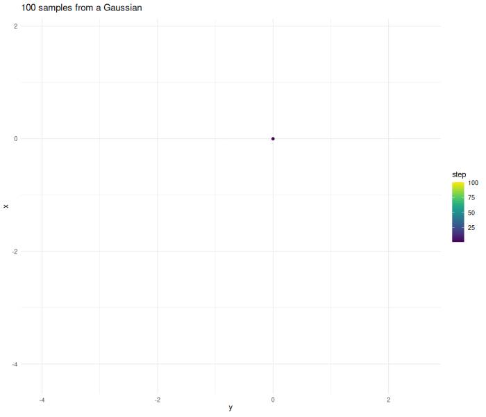
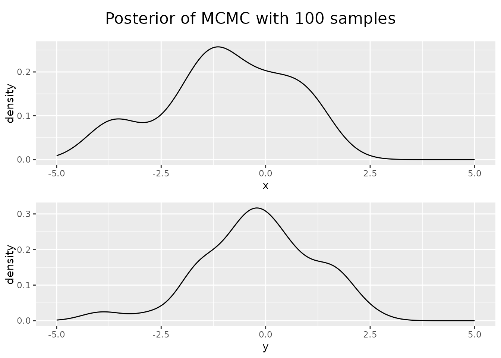
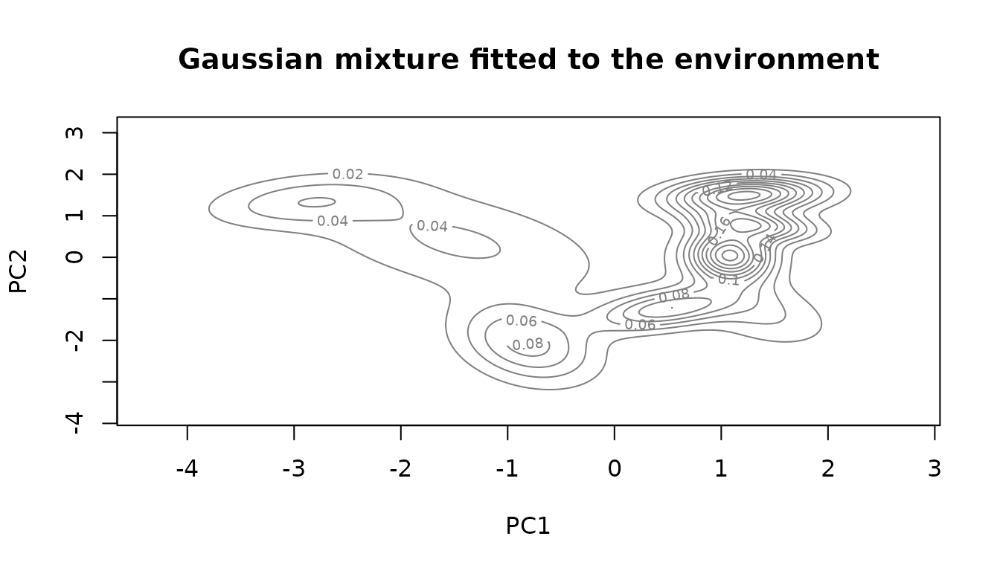
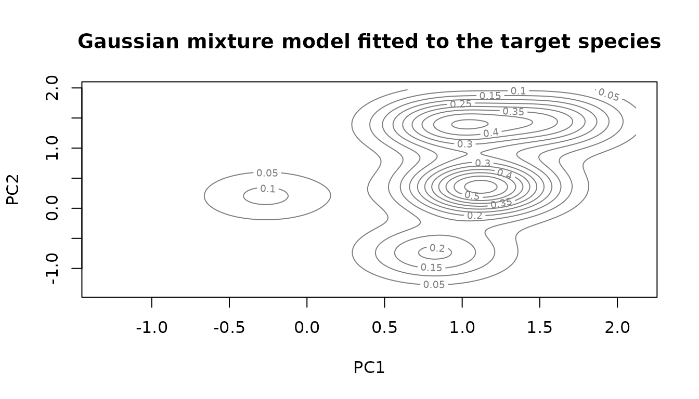
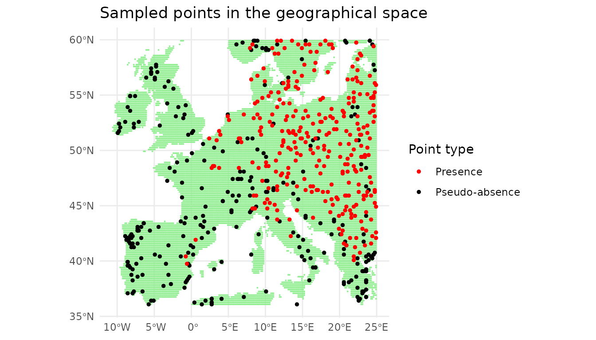

# Insights on Markov chain based pseudo-absence sampling

This vignette gives insights into how MCMC works and how it can be used
to sample pseudo-absences. It builds on the idea of nearest neighbor
mapping. This concept is explained in detail in the [insights on nearest
neighbor
search](https://mdmdma.github.io/USE.MCMC/articles/Insights-on-nearest-neighbor-search.md).

``` r
library(USE.MCMC)
library(terra)
library(virtualspecies)
library(sf)
library(ggplot2)
library(parallel)
library(FNN)
library(coda)
library(gganimate)
library(tcltk)
#> Warning: no DISPLAY variable so Tk is not available
library(viridis)
library(cowplot)
library(entropy)
set.seed(40)
```

Before we can understand why Markov chains are useful, we have to
understand how they work.

For our use-case, Markov chains can be understood as a random walk. From
a given starting point the chain starts to explore the given space.
Given the current point, we calculate the update step. In this case,
this step is two dimensional Gaussian noise. The algorithm then decides
if it wants to accept this proposed point. In this first example we
accept all points.

``` r
starting.point <- data.frame(x=0, y=0)
sampled.points <- USE.MCMC::mcmcSampling(dataset=starting.point,
                               dimensions = c("x", "y"),
                               densityFunction = alwaysOne,
                               proposalFunction = addHighDimGaussian(dim=2),
                               burnIn = 0,
                               covariance.correction = 1, 
                               n.sample.points = 100,
                               verbose = FALSE)
```


In practical cases a Markov chain does not perform a completely random
walk. The chain tries to replicate some kind of target function. In the
case above this function is one everywhere. Therefore the chain explores
in all directions and without limit. In this unbounded case the chain
does not converge to a stationary state.

In a real use case we want to generate samples from a target density. We
can supply the MCMC algorithm with this function that represents the
distribution we want to replicate.

Lets make an example and create samples from a two dimensional Gaussian.

``` r
densityFunctionGaussian <- function(point, lengthscale=5){
  density <- exp(-(point$x ** 2 + point$y ** 2) / lengthscale)
}
d <- densityFunctionGaussian(sampled.points)
sampled.points.gaussian <- mcmcSampling(dataset=starting.point,
                                  dimensions = c("x", "y"),
                                  densityFunction = densityFunctionGaussian,
                                  proposalFunction = addHighDimGaussian(dim=2),
                                  burnIn = 0,
                                  covariance.correction = 13,
                                  n.sample.points = 100,
                                  verbose = FALSE)
```

The further the chain wanders away from the origin the higher the
probability gets that the proposed point gets rejected.

 As before the proposal step is
completely random. The algorithm now decides if it wants to accept the
proposed next point using the Metropolis–Hastings algorithm. \$\$

= , p\_{n+1} = $$\begin{cases}
{p\prime} & {\alpha > n,n \sim \mathcal{U}(0,1)} \\
p_{n} & \text{otherwise}
\end{cases}$$

\$\$ Given a point $p_{n}$ we calculate a proposed point $p\prime$. The
function $d(p)$ guides our chain. If the value of $d(p\prime)$ is higher
at the new location, the chain always continues. If the value of $d(p)$
is lower at the new location the chain sometimes transitions. This
guarantees that the whole space is eventually sampled. This assumption
only holds up if we sample for enough steps and the sampled function is
compact, in addition to probably other things.

Looking at the posterior of our sampled points, the distribution of x
and y values of our points, we see that they resemble Gaussian, but our
sample size was too small.

Increasing the sample size results in a better approximation.

``` r
sampled.points.gaussian <- mcmcSampling(dataset=starting.point,
                                  dimensions = c("x", "y"),
                                  densityFunction = densityFunctionGaussian,
                                  proposalFunction = addHighDimGaussian(dim=2),
                                  burnIn = FALSE, 
                                  n.sample.points = 10000,
                                  verbose = FALSE)
#> Burn in skipped
#> The final covariance correction is  1 
#> 
#> Points rejected:  2994
```


In this low dimensional case with a simple function there are more
simple ways to generate samples. The case where MCMC gets useful for
sample generation is if the function is very complicated and expensive
to compute and in case our problem lives in high dimensions.

Lets explore the dimensionality issue first. If we compute the value of
our function on a grid with 100 cells per dimension—a moderate
resolution—this results in 10,000 points in the two-dimensional case. In
the five-dimensional case, this results in 10 billion points.
Computational and memory requirements become limiting factors for
application of such approaches.

In case of MCMC sampling the computational complexity increases, but
less fast. The function that we have to evaluate to decide if we want to
accept a new point becomes more complex and we have to run the chain for
longer until we have good convergence.

## pseudo-absence sampling

If we want to use MCMC to generate pseudo-absences we first have to
construct the function that represents the density of our
pseudo-absences in the environmental space.

Here we demonstrate an approach using Gaussian mixtures. As the example
above shows we can generate sample points from a Gaussian
distribution.We can also use sample points to find the Gaussian that
explains the given data best. In a Gaussian mixture model we do not only
fit one Gaussian, but can find the number of Gaussian that approximates
the given point distribution.

For the Gaussian mixture model to fit the data well it has to resemble a
multi-modal Gaussian. The environment does not necessarily have this
structure. We therefore perform a PCA to have a more simple structure in
our data and reduce its dimensionality.

In a first step, we have to decide which dimensions we want to sample
uniformly.

``` r
dimensions <- c("PC1", "PC2")
```

``` r
env.data.raster <- USE.MCMC::Worldclim_tmp %>%
  terra::rast(type="xyz") %>%
  round(2) 

rpc <- rastPCA(env.data.raster,  stand = TRUE)

env.data.raster.with.pc <- c(env.data.raster, rpc$PCs)

env.data.sf <- env.data.raster %>%
    as.data.frame(xy = TRUE) %>%
    sf::st_as_sf(coords = c("x", "y"))

  # Attaching the data in the PCA coordinates
env.with.pc.sf <- rpc$PCs %>%
  as.data.frame(xy = TRUE) %>%
  na.omit() %>%
  sf::st_as_sf(coords = c("x", "y")) %>%
  sf::st_join(env.data.sf)

env.data.cleaned <- sf::st_drop_geometry(env.with.pc.sf[dimensions])
```

To generate pseudo-absences we use two Gaussian mixture models. In a
first step we fit the points in our environment. This part of the model
is later used to stop our chain from wandering into areas outside our
environment.


We subsample the environment to speed up the computation. As fitting
Gaussian mixtures is a statistical process and the dataset is still
large this is justified. In addition to that this model is only used to
keep the chain in bound. Other techniques are later used to exclude
parts of the chain that are too far from the real data.

``` r
env.with.pc.sf.subsampled <- env.with.pc.sf[
  stats::runif(min(nrow(env.with.pc.sf), 2000) , 1, nrow(env.with.pc.sf)),]
env.data.cleaned.subsampled <- sf::st_drop_geometry(
  env.with.pc.sf.subsampled[dimensions])
environmental.data.model <- mclust::densityMclust(env.data.cleaned.subsampled)
title("Gaussian mixture fitted to the environment")
```



The fitted model is a function that gives us the sum of the Gaussian
components at each location. The higher the value the higher the
probably to find a point at the given location. In our case we want to
sample the environmental space uniformly, not reproduce the underlying
distribution. We use this environmental model only to set the boundaries
for our chain.

The model density at the points in the environment can be used to find
the threshold under which no points are expected any more.

``` r
environmental.densities <- mclust::predict.densityMclust(
  environmental.data.model, env.data.cleaned)
environmental.threshold <- stats::quantile(environmental.densities, 0.01)
```

We can now start to construct the function that our chain tries to
sample from.

``` r
densityFunctionNaive <- function(env.model, env.threshold, dimensions){
  densityFunction <- function(point){
    point <- as.data.frame(point)
    point <- sf::st_drop_geometry(point[dimensions]) %>%
      as.matrix()
    env.density <- mclust::predict.densityMclust(env.model, point)
    if (env.density < env.threshold){
      return(0)
    } else {
      return(1)
    }
  }
}

densityFunction <- densityFunctionNaive(environmental.data.model,
                                        environmental.threshold,
                                        dimensions)
```

As we are in the two dimensional case we can plot the function.


We can now use the Markov chain algorithm from before to generate
samples from this function.

``` r
sampled.points.naive.density <- mcmcSampling(dataset = env.with.pc.sf,
                                      dimensions = dimensions,
                                      densityFunction = densityFunction,
                                      n.sample.points = 5000,
                                      burnIn = 100,
                                      covariance.correction = 13)
```


We can now sample our environmental space uniformly. pseudo-absences
should not only be uniformly distributed but also evade the conditions
under which the species we try to model flourishes. We have to extend
the function from above to reflect that

``` r
virtual.presence.data <- getVirtualSpeciesPresencePoints(
  env.data = env.data.raster.with.pc, n.samples = 300)
#> Reading raster values. If it fails for very large rasters, use arguments 'sample.points = TRUE' and define a number of points to sample with 'nb.point'.
#>  - Perfoming the pca
#>  - Defining the response of the species along PCA axes
#>  - Calculating suitability values
#>    The final environmental suitability was rescaled between 0 and 1.
#>                   To disable, set argument rescale = FALSE
#>    --- Determing species.prevalence automatically according to alpha and beta
#>    Logistic conversion finished:
#>               
#> - beta = 0.55
#> - alpha = -0.05
#> - species prevalence =0.453490212631246
virtual.presence.points <- virtual.presence.data$sample.points
virtual.presence.points.pc <- terra::extract(env.data.raster.with.pc,
                                             virtual.presence.points,
                                             bind = TRUE) %>%
  sf::st_as_sf()
```

As before we can fit a Gaussian mixture to the given data points of the
model species.

``` r
species.model = mclust::densityMclust(sf::st_drop_geometry(virtual.presence.points.pc[dimensions]))
species.densities <- species.model$density
species.cutoff.threshold <- stats::quantile(species.densities, 0.9)
title("Gaussian mixture model fitted to the target species")
```



Now we can build a function that describes the distribution of
pseudo-absences. To evade the presence we subtract the value of the
presence model. The value of the presence model can be scaled to tune
how strongly the presence species is avoided. We do this by selecting
the density at a given quantile of the presence points and scale the
whole function so that the value becomes 1. As we subtract it from the
former function value, we now get values below zero in these areas,
meaning we will never visit them with the chain.

``` r
densityFunctionPseudoAbsences <- function(env.model, env.threshold,
                                  pres.model, pres.threshold, 
                                  dimensions){
  densityFunction <- function(point){
    point <- sf::st_drop_geometry(point[dimensions]) %>%
      as.matrix()
    env.density <- mclust::predict.densityMclust(env.model, point)
    if (env.density < env.threshold){
      return(0)
    } else {
      return(
        max(0, 1-mclust::predict.densityMclust(pres.model, point) /
              pres.threshold)
        )
    }
  }
}

densityFunction <- densityFunctionPseudoAbsences(environmental.data.model,
                                                 environmental.threshold,
                                                 species.model,
                                                 species.cutoff.threshold,
                                                 dimensions)
```

As before we can plot the function we want to sample from.


``` r
sampled.points.ps.density <- mcmcSampling(dataset = env.with.pc.sf,
                                      dimensions = dimensions,
                                      densityFunction = densityFunction,
                                      n.sample.points = 5000,
                                      burnIn = 100,
                                      covariance.correction = 20)
```

``` r

sampled.points.ps.density$step <- 1:nrow(sampled.points.ps.density)
p.chain.ps.density <- ggplot(sampled.points.ps.density) + 
  geom_point(aes(x=PC1, y=PC2, color=step)) + 
  geom_path(aes(x=PC1, y=PC2, color=step)) + 
  theme_minimal() +
  labs(title = "Chain on full pseudo-absence model")  + 
  scale_color_viridis()

a.chain.ps.density <- p.chain.ps.density +
  transition_time(step) + ease_aes('linear') +
  transition_reveal(step) +
  exit_shrink() +
  shadow_trail(alpha = 0.3)

gif.chain.ps.density <- animate(a.chain.ps.density, renderer = gifski_renderer(), width = 700, height = 400, fps = 10, duration = 10)
anim_save("chain.ps.density.gif", gif.chain.ps.density)
```


So far the sample points are real points in the environment. They only
have values for the dimension we wanted to sample. To get real points
again we use the nearest neighbor search. The technique is further
described in [insights on nearest neighbor
search](https://mdmdma.github.io/USE.MCMC/articles/Insights-on-nearest-neighbor-search.md).
The core of the idea is that we can compute the distance from a sample
point to other points in the dataset and choose the point with the
shortest distance to represent our sample point.

``` r
sampled.points <- sampled.points.ps.density
mapped.sampled.point.locations <- FNN::get.knnx(
  env.data.cleaned[dimensions], sampled.points[dimensions],k = 1)
mapped.sampled.points <- env.with.pc.sf[
  mapped.sampled.point.locations$nn.index,]
mapped.sampled.points$density <- sampled.points$density
mapped.sampled.points$distance <- mapped.sampled.point.locations$nn.dist
```

Now we have real points in our environment with a geographical location.
The model of our environment is not perfect. The distance to the
remapped point gives an indication on how far the chain wandered off the
real data points. We can use it to filter points that originated in
areas where our environmental model was bad. The distance that lies
between a point and its origin should never be more than half the
maximal distance between points in the dataset.

``` r
nearest.neighbors.distance<- FNN::knn.dist(env.data.cleaned[dimensions],
                                           k=3) %>%
  as.vector()

sorted.nearest.neighbor.distances <- sort(nearest.neighbors.distance, 
                                          decreasing=TRUE)
distance.threshold <- sorted.nearest.neighbor.distances[2] / 2

mapped.sampled.points.filtered <- mapped.sampled.points[
  mapped.sampled.points$distance < distance.threshold, ]
```

In a last step we can select the desired number of points from our
chain.

``` r
n.samples <- 300
mapped.sampled.points.selected <- mapped.sampled.points.filtered[
  runif(n.samples, 0, nrow(mapped.sampled.points.filtered)), ]
```

We can look at our points in the environmental space


Looking at the posteriors we can see that we managed to sample the
environmental space uniformly.


For the selected dimensions the posterior density is flat, for the other
ones, in this case principal component three, the distribution follows
the environment.

The sampled points can also be plotted in the geographical space.


So far we did nothing revolutionary. All of the given can be done using
existing techniques.The advantage emerges when we want to increase the
dimensions included. The only thing that has to change is the vector
from the beginning in which we stated the dimensions to include. As the
results are getting difficult to represent in 2d plots, we focus on the
results of such computations.

The function paSamplingMcmc wraps what we did so far in this vignette
into one single concise function to efficiently create pseudo-absences.

``` r
# One core is used for rendering the vignette, for interactive use this can be set higher
sampled.points.mcmc.higher.dim <- paSamplingMcmc(env.data.raster = env.data.raster,
                                      pres = virtual.presence.points,
                                      precomputed.pca = rpc,
                                      environmental.cutof.percentile = 0.001,
                                      num.chains = 4,
                                      num.cores = 1,
                                      chain.length = 10000,
                                      n.samples = 500,
                                      covariance.correction = 70,
                                      verbose = FALSE,
                                      dimensions = c("PC1", "PC2", "PC3"))
```

By including the third dimension into the algorithm we now get a flat
posterior density also for it.


\# Conververnce A topic not cover so far is convergence. The reason why
we use MCMC is to reduce computational complexity of our problem.
Therefore we have to know how long we have to run the algorithm and how
many chains we should combine to get satisfying results.

To evaluate these issues let’s first generate some long chains.

``` r
dimensions <- c("PC1", "PC2", "PC3")
# Environmental model in 3 dimensions
env.with.pc.sf.subsampled <- env.with.pc.sf[
  stats::runif(min(nrow(env.with.pc.sf), 2000) , 1, nrow(env.with.pc.sf)),] %>%
  sf::st_drop_geometry()
env.data.cleaned.subsampled <- sf::st_drop_geometry(
  env.with.pc.sf.subsampled[dimensions])
environmental.data.model <- mclust::densityMclust(env.data.cleaned.subsampled)
```


``` r

env.data.cleaned <- sf::st_drop_geometry(env.with.pc.sf[dimensions])

environmental.densities <- mclust::predict.densityMclust(
  environmental.data.model, env.data.cleaned)
environmental.threshold <- stats::quantile(environmental.densities, 0.04)

#species model in 3 dimensions
species.model = mclust::densityMclust(sf::st_drop_geometry(virtual.presence.points.pc[dimensions]))
```


``` r
species.densities <- species.model$density
species.cutoff.threshold <- stats::quantile(species.densities, 0.9)

covariance.scaling <-0.075
covariance.matrix <- stats::cov(sf::st_drop_geometry(env.with.pc.sf)[dimensions])
proposalFunction <- addHighDimGaussian(cov.mat =covariance.scaling * covariance.matrix,
                                       dim = length(dimensions))


densityFunction <- mclustDensityFunction(env.model = environmental.data.model,
                                         species.model = species.model,
                                         dim = dimensions,
                                         threshold = environmental.threshold,
                                         species.cutoff.threshold = species.cutoff.threshold)

chain.list <- list()
chain.list <- mclapply(1:4, function(i) {
  capture.output({
    sampled.points <- mcmcSampling(dataset = env.with.pc.sf.subsampled,
                                   dimensions = dimensions,
                                   n.sample.points = 5000,
                                   densityFunction = densityFunction,
                                   proposalFunction = proposalFunction,
                                   burnIn = 1000,
                                   covariance.correction = 50,
                                   verbose = TRUE)
  })
  chain.list[[i]] <- coda::as.mcmc(sampled.points[dimensions])
}, mc.cores = 1)
coda.chain.list <- coda::mcmc.list(chain.list)
```

We can now look at the Gelman-Rubin plot of the chain ensemble. For the
second and third principle component convergence is reached, looking at
the first principle component it seems like the chain should run for
longer. The needed runtime depends on how complex the environmental
space is and on the number of dimensions included.

``` r
coda::gelman.plot(coda.chain.list)
```


Entropy is a measure for information. The higher the entropy, the more
information a dataset contains. We can plot how the entropy of a chain
evolves over time

The entropy stabilizes and is similar, indicating that they are well
mixed. Looking at the autocorrelation we get an insight of how much
thinning we have to do if we want the assumption of independently
sampled points should hold. After a lag of around 30 the autocorrelation
stays within the bounds of the long-running range.


We can now compare our newly introduced method to other sampling
approaches. Here we compare it to other approaches that sample uniformly
in the environmental space. We see that if we only use uniform sampling
on two dimensions, the new method performs as the old methods, if we
extend the sampling to 3 dimensions, we also sample the third dimension
uniformly. This comes at the cost of having less uniform sampling along
the first two dimensions. While looking like an issue, it probably
represents more uniform samples, as we want to sample the environmental
volume uniformly, not the single components them self. If component
three has a large range at pc1 = 1, we expect the density of pc1 to be
higher at pc1 = 1

``` r
sampled.points.uniform.p <- paSampling(env.rast = env.data.raster,
                                       pres = virtual.presence.points, 
                                       grid.res = 10)
sampled.points.uniform.p.location <- sf::st_drop_geometry(
  sampled.points.uniform.p) %>%
  dplyr::select(c("x", "y")) %>%
  sf::st_as_sf(coords = c("x", "y"))
sampled.points.uniform.paper <- terra::extract(
  env.data.raster.with.pc, 
  sampled.points.uniform.p.location)
```

``` r
n.sample.points <- 300
sampled.points.uniform.nn <- paSamplingNn(env.rast = env.data.raster,
                                          pres = virtual.presence.points,
                                          grid.res = 15, n.tr = 2,
                                          n.samples = n.sample.points)
```

``` r
sampled.points.random.geo <- env.with.pc.sf[
  stats::runif(min(nrow(env.with.pc.sf), n.sample.points) , 1, nrow(env.with.pc.sf)),]
```


