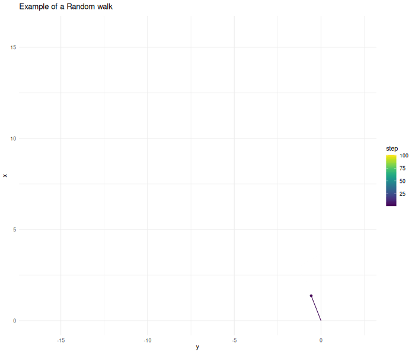
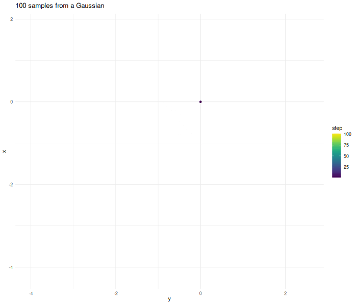
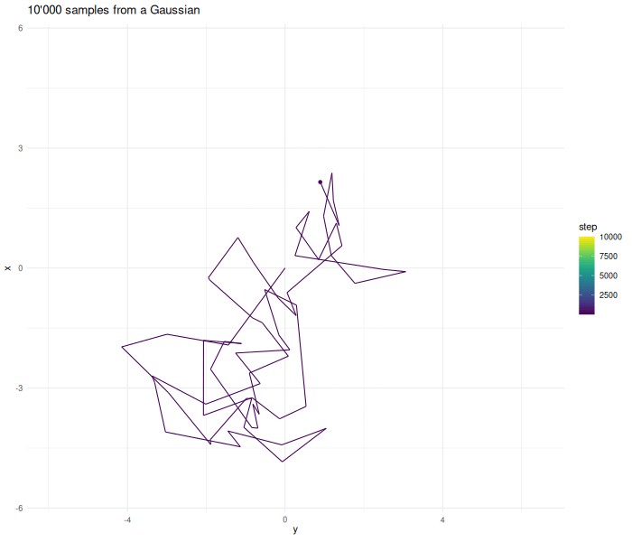
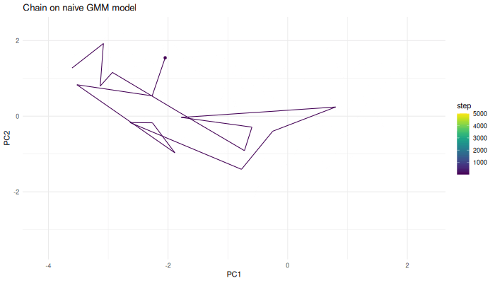
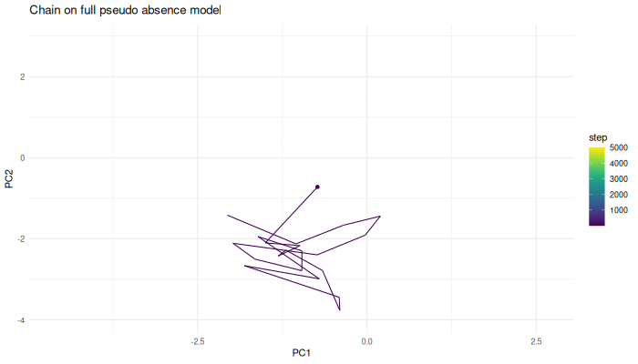

```{r, include = FALSE}
knitr::opts_chunk$set(
  collapse = TRUE,
  comment = "#>"
)
```

This vignette gives insights into how MCMC works and how it can be used to sample pseudo-absences. It builds on the idea of nearest neighbor mapping. This concept is explained in detail in the [insights on nearest neighbor search](Insights-on-nearest-neighbor-search.html).
```{r setup, message=FALSE}
library(USE.MCMC)
library(terra)
library(virtualspecies)
library(sf)
library(ggplot2)
library(parallel)
library(FNN)
library(coda)
library(gganimate)
library(tcltk)
library(viridis)
library(cowplot)
library(entropy)
set.seed(40)
```

Before we can understand why Markov chains are useful, we have to understand how they work. 

For our use-case, Markov chains can be understood as a random walk. From a given starting point the chain starts to explore the given space. Given the current point, we calculate the update step. In this case, this step is two dimensional Gaussian noise. The algorithm then decides if it wants to accept this proposed point. In this first example we accept all points.

```{r generate-sample-chain, message=FALSE, results="hide"}
starting.point <- data.frame(x=0, y=0)
sampled.points <- USE.MCMC::mcmcSampling(dataset=starting.point,
                               dimensions = c("x", "y"),
                               densityFunction = alwaysOne,
                               proposalFunction = addHighDimGaussian(dim=2),
                               burnIn = 0,
                               covariance.correction = 1, 
                               n.sample.points = 100,
                               verbose = FALSE)
```
```{r animate-sample-chain, eval=FALSE, echo=FALSE}
starting.point$density <- 1
sampled.points <- rbind(starting.point, sampled.points)
sampled.points$step <- 1:nrow(sampled.points)
p.example.chain <- ggplot(sampled.points) + 
  geom_point(aes(x=y, y=x, color=step)) + 
  geom_path(aes(x=y, y=x, color=step)) + 
  theme_minimal() +
  labs(title = "Example of a Random walk")  + 
  scale_color_viridis()

a.example.chain <- p.example.chain +
  transition_time(step) +
  ease_aes('linear') +
  transition_reveal(step) +
  exit_shrink() +
  shadow_trail(alpha = 0.3)

gif.example.chain <- gganimate::animate(a.example.chain, renderer = gifski_renderer(), width = 700, height = 600, fps = 10, duration = 4)
anim_save("gif_example_chain.gif", gif.example.chain)
```


In practical cases a Markov chain does not perform a completely random walk. The chain tries to replicate some kind of target function. In the case above this function is one everywhere. Therefore the chain explores in all directions and without limit. In this unbounded case the chain does not converge to a stationary state. 

In a real use case we want to generate samples from a target density. We can supply the MCMC algorithm with this function that represents the distribution we want to replicate. 

Lets make an example and create samples from a two dimensional Gaussian.

```{r generate-sample-gaussian-chain, results="hide"}
densityFunctionGaussian <- function(point, lengthscale=5){
  density <- exp(-(point$x ** 2 + point$y ** 2) / lengthscale)
}
d <- densityFunctionGaussian(sampled.points)
sampled.points.gaussian <- mcmcSampling(dataset=starting.point,
                                  dimensions = c("x", "y"),
                                  densityFunction = densityFunctionGaussian,
                                  proposalFunction = addHighDimGaussian(dim=2),
                                  burnIn = 0,
                                  covariance.correction = 13,
                                  n.sample.points = 100,
                                  verbose = FALSE)
```
The further the chain wanders away from the origin the higher the probability gets that the proposed point gets rejected. 
```{r animate-sample-gaussian-chain, echo=FALSE, eval=FALSE}
starting.point$density <- 1
sampled.points.gaussian <- rbind(starting.point, sampled.points.gaussian)
sampled.points.gaussian$step <- 1:nrow(sampled.points.gaussian)
p.example.chain.gaussian <- ggplot(sampled.points.gaussian) + 
  geom_point(aes(x=y, y=x, color=step)) + 
  geom_path(aes(x=y, y=x, color=step)) + 
  theme_minimal() +
  labs(title = "100 samples from a Gaussian")  + 
  scale_color_viridis()

a.example.chain.gaussian <- p.example.chain.gaussian +
  transition_time(step) + ease_aes('linear') +
  transition_reveal(step) +
  exit_shrink() +
  shadow_trail(alpha = 0.3)

gif.example.chain.gaussian <- animate(a.example.chain.gaussian, renderer = gifski_renderer(), width = 700, height = 600, fps = 10, duration = 6)
anim_save("gif_example_chain_gaussian.gif", gif.example.chain.gaussian)
```


As before the proposal step is completely random. The algorithm now decides if it wants to accept the proposed next point using the Metropolis–Hastings algorithm.
$$

\alpha = \frac{d(p')}{d(p)}, \quad p_{n+1} = \begin{cases}
        p' & \alpha >n, n\sim \mathcal{U}(0,1)  \\
        p_n & \text{otherwise}
    \end{cases}
$$
Given a point $p_n$ we calculate a proposed point $p'$. The function $d(p)$ guides our chain. If the value of $d(p')$ is higher at the new location, the chain always continues. If the value of $d(p)$ is lower at the new location the chain sometimes transitions. This guarantees that the whole space is eventually sampled. This assumption only holds up if we sample for enough steps and the sampled function is compact, in addition to probably other things.

Looking at the posterior of our sampled points, the distribution of x and y values of our points, we see that they resemble Gaussian, but our sample size was too small.
```{r gaussian-posterior-plot, echo=FALSE, fig.height=5, fig.width=7, warning=FALSE}
p.gaussian.posterior.x.limited.samplesize <- ggplot(sampled.points.gaussian) +
  geom_density(aes(x=x)) +
  xlim(-5,5)

p.gaussian.posterior.y.limited.samplesize <- ggplot(sampled.points.gaussian) +
  geom_density(aes(x=y)) +
  xlim(-5,5)

titled_plot <- plot_grid(
  draw_label("My Combined Plot Title", size = 14, fontface = "bold"),
  grid,
  ncol = 1,
  rel_heights = c(0.1, 1)
)

ggdraw() + 
  draw_plot(cowplot::plot_grid(p.gaussian.posterior.x.limited.samplesize,
                   p.gaussian.posterior.y.limited.samplesize,
                   ncol = 1),
            height = 0.9) +
  draw_label("Posterior of MCMC with 100 samples", 
             x = 0.5, y = 0.95, size = 16)
```
Increasing the sample size results in a better approximation.
```{r sample-gaussian-large-number-of-samples}
sampled.points.gaussian <- mcmcSampling(dataset=starting.point,
                                  dimensions = c("x", "y"),
                                  densityFunction = densityFunctionGaussian,
                                  proposalFunction = addHighDimGaussian(dim=2),
                                  burnIn = FALSE, 
                                  n.sample.points = 10000,
                                  verbose = FALSE)
```
```{r animate-sample-gaussian-chain-long, echo=FALSE, eval=FALSE}
starting.point$density <- 1
sampled.points.gaussian <- rbind(starting.point, sampled.points.gaussian)
sampled.points.gaussian$step <- 1:nrow(sampled.points.gaussian)
p.example.chain.gaussian <- ggplot(sampled.points.gaussian) + 
  geom_point(aes(x=y, y=x, color=step)) + 
  geom_path(aes(x=y, y=x, color=step)) + 
  theme_minimal() +
  labs(title = "10'000 samples from a Gaussian")  + 
  scale_color_viridis()

a.example.chain.gaussian <- p.example.chain.gaussian +
  transition_time(step) + ease_aes('linear') +
  transition_reveal(step) +
  exit_shrink() +
  shadow_trail(alpha = 0.3)

gif.example.chain.gaussian <- animate(a.example.chain.gaussian, renderer = gifski_renderer(), width = 700, height = 600, fps = 10, duration = 6)
anim_save("gif_example_chain_gaussian_long.gif", gif.example.chain.gaussian)
```

```{r gaussian-posterior-plot-more-samples, echo=FALSE, fig.height=5, fig.width=7, warning=FALSE}
p.gaussian.posterior.x.limited.samplesize <- ggplot(sampled.points.gaussian) +
  geom_density(aes(x=x)) +
  xlim(-5,5)

p.gaussian.posterior.y.limited.samplesize <- ggplot(sampled.points.gaussian) +
  geom_density(aes(x=y)) +
  xlim(-5,5)

ggdraw() + 
  draw_plot(cowplot::plot_grid(p.gaussian.posterior.x.limited.samplesize,
                   p.gaussian.posterior.y.limited.samplesize,
                   ncol = 1),
            height = 0.9) +
  draw_label("Posterior of MCMC with 10000 samples", 
             x = 0.5, y = 0.95, size = 16)
```

In this low dimensional case with a simple function there are more simple ways to generate samples. The case where MCMC gets useful for sample generation is if the function is very complicated and expensive to compute and in case our problem lives in high dimensions. 

Lets explore the dimensionality issue first. If we compute the value of our function on a grid with 100 cells per dimension—a moderate resolution—this results in 10,000 points in the two-dimensional case. In the five-dimensional case, this results in 10 billion points. Computational and memory requirements become limiting factors for application of such approaches.

In case of MCMC sampling the computational complexity increases, but less fast. The function that we have to evaluate to decide if we want to accept a new point becomes more complex and we have to run the chain for longer until we have good convergence. 

# pseudo-absence sampling

If we want to use MCMC to generate pseudo-absences we first have to construct the function that represents the density of our pseudo-absences in the environmental space. 

Here we demonstrate an approach using Gaussian mixtures. As the example above shows we can generate sample points from a Gaussian distribution.We can also use sample points to find the Gaussian that explains the given data best. In a Gaussian mixture model we do not only fit one Gaussian, but can find the number of Gaussian that approximates the given point distribution. 

For the Gaussian mixture model to fit the data well it has to resemble a multi-modal Gaussian. The environment does not necessarily have this structure. We therefore perform a PCA to have a more simple structure in our data and reduce its dimensionality.

In a first step, we have to decide which dimensions we want to sample uniformly.
```{r set-dimesnions}
dimensions <- c("PC1", "PC2")
```

```{r load-data}
env.data.raster <- USE.MCMC::Worldclim_tmp %>%
  terra::rast(type="xyz") %>%
  round(2) 

rpc <- rastPCA(env.data.raster,  stand = TRUE)

env.data.raster.with.pc <- c(env.data.raster, rpc$PCs)

env.data.sf <- env.data.raster %>%
    as.data.frame(xy = TRUE) %>%
    sf::st_as_sf(coords = c("x", "y"))

  # Attaching the data in the PCA coordinates
env.with.pc.sf <- rpc$PCs %>%
  as.data.frame(xy = TRUE) %>%
  na.omit() %>%
  sf::st_as_sf(coords = c("x", "y")) %>%
  sf::st_join(env.data.sf)

env.data.cleaned <- sf::st_drop_geometry(env.with.pc.sf[dimensions])
```

To generate pseudo-absences we use two Gaussian mixture models. In a first step we fit the points in our environment. This part of the model is later used to stop our chain from wandering into areas outside our environment.

```{r plot-env-data, message=FALSE, fig.height=4, fig.width=7, echo=FALSE}
p.points.in.the.environment <- ggplot() + 
  geom_point(data=env.data.cleaned,
             aes(x=PC1, y=PC2),
             color = "black", 
             size=0.2) + 
  labs(title = "Points of the environmeltal dataset",
       )
p.points.in.the.environment
```

We subsample the environment to speed up the computation. As fitting Gaussian mixtures is a statistical process and the dataset is still large this is justified. In addition to that this model is only used to keep the chain in bound. Other techniques are later used to exclude parts of the chain that are too far from the real data.

```{r fit-environmental-model, message=FALSE, fig.height=4, fig.width=7}
env.with.pc.sf.subsampled <- env.with.pc.sf[
  stats::runif(min(nrow(env.with.pc.sf), 2000) , 1, nrow(env.with.pc.sf)),]
env.data.cleaned.subsampled <- sf::st_drop_geometry(
  env.with.pc.sf.subsampled[dimensions])
environmental.data.model <- mclust::densityMclust(env.data.cleaned.subsampled)
title("Gaussian mixture fitted to the environment")
```

The fitted model is a function that gives us the sum of the Gaussian components at each location. The higher the value the higher the probably to find a point at the given location. In our case we want to sample the environmental space uniformly, not reproduce the underlying distribution. We use this environmental model only to set the boundaries for our chain. 

The model density at the points in the environment can be used to find the threshold under which no points are expected any more.

```{r set-environmental-threshold}
environmental.densities <- mclust::predict.densityMclust(
  environmental.data.model, env.data.cleaned)
environmental.threshold <- stats::quantile(environmental.densities, 0.01)
```

We can now start to construct the function that our chain tries to sample from. 

```{r set-naive-density-funciton}
densityFunctionNaive <- function(env.model, env.threshold, dimensions){
  densityFunction <- function(point){
    point <- as.data.frame(point)
    point <- sf::st_drop_geometry(point[dimensions]) %>%
      as.matrix()
    env.density <- mclust::predict.densityMclust(env.model, point)
    if (env.density < env.threshold){
      return(0)
    } else {
      return(1)
    }
  }
}

densityFunction <- densityFunctionNaive(environmental.data.model,
                                        environmental.threshold,
                                        dimensions)
```
As we are in the two dimensional case we can plot the function.

```{r plot-simple-denisty, echo=FALSE, fig.height=4, fig.width=7}
gridsize <- 100
grid <- expand.grid(
  x = seq(min(env.data.cleaned$PC1), max(env.data.cleaned$PC1), length.out = gridsize),
  y = seq(min(env.data.cleaned$PC2), max(env.data.cleaned$PC2), length.out = gridsize)
)
names(grid) <- c("PC1", "PC2")

grid$density <- purrr::map_dbl(1:nrow(grid), ~ densityFunction(grid[.x, , drop = FALSE]))

p.density.naive <- ggplot() + 
  geom_tile(data=grid, aes(x=PC1, y=PC2, fill=density)) + 
  geom_point(data=env.data.cleaned, aes(x=PC1, y=PC2), size = 0.1) +
  theme_minimal() + 
  labs(title = "Density function in the naive case") 
  
print(p.density.naive)
```

We can now use the Markov chain algorithm from before to generate samples from this function. 

```{r sample-naive-points, results="hide"}
sampled.points.naive.density <- mcmcSampling(dataset = env.with.pc.sf,
                                      dimensions = dimensions,
                                      densityFunction = densityFunction,
                                      n.sample.points = 5000,
                                      burnIn = 100,
                                      covariance.correction = 13)
```

```{r animate-naive-points, eval=FALSE, echo=FALSE}

sampled.points.naive.density$step <- 1:nrow(sampled.points.naive.density)
p.chain.naive.density <- ggplot(sampled.points.naive.density) + 
  geom_point(aes(x=PC1, y=PC2, color=step)) + 
  geom_path(aes(x=PC1, y=PC2, color=step)) + 
  theme_minimal() +
  labs(title = "Chain on naive GMM model")  + 
  scale_color_viridis()

a.chain.naive.density <- p.chain.naive.density +
  transition_time(step) + ease_aes('linear') +
  transition_reveal(step) +
  exit_shrink() +
  shadow_trail(alpha = 0.3)

gif.chain.naive.density <- animate(a.chain.naive.density, renderer = gifski_renderer(), width = 700, height = 400, fps = 10, duration = 10)
anim_save("chain.naive.density.gif", gif.chain.naive.density)
```


We can now sample our environmental space uniformly. pseudo-absences should not only be uniformly distributed but also evade the conditions under which the species we try to model flourishes. We have to extend the function from above to reflect that

```{r generate-virtual-species, results="hide"}
virtual.presence.data <- getVirtualSpeciesPresencePoints(
  env.data = env.data.raster.with.pc, n.samples = 300)
virtual.presence.points <- virtual.presence.data$sample.points
virtual.presence.points.pc <- terra::extract(env.data.raster.with.pc,
                                             virtual.presence.points,
                                             bind = TRUE) %>%
  sf::st_as_sf()
```

As before we can fit a Gaussian mixture to the given data points of the model species.

```{r fit-species-model, message=FALSE, fig.height=4, fig.width=7}
species.model = mclust::densityMclust(sf::st_drop_geometry(virtual.presence.points.pc[dimensions]))
species.densities <- species.model$density
species.cutoff.threshold <- stats::quantile(species.densities, 0.9)
title("Gaussian mixture model fitted to the target species")

```

Now we can build a function that describes the distribution of pseudo-absences. To evade the presence we subtract the value of the presence model. The value of the presence model can be scaled to tune how strongly the presence species is avoided. We do this by selecting the density at a given quantile of the presence points and scale the whole function so that the value becomes 1. As we subtract it from the former function value, we now get values below zero in these areas, meaning we will never visit them with the chain.

```{r full-pseudo-absence-density-funciton}
densityFunctionPseudoAbsences <- function(env.model, env.threshold,
                                  pres.model, pres.threshold, 
                                  dimensions){
  densityFunction <- function(point){
    point <- sf::st_drop_geometry(point[dimensions]) %>%
      as.matrix()
    env.density <- mclust::predict.densityMclust(env.model, point)
    if (env.density < env.threshold){
      return(0)
    } else {
      return(
        max(0, 1-mclust::predict.densityMclust(pres.model, point) /
              pres.threshold)
        )
    }
  }
}

densityFunction <- densityFunctionPseudoAbsences(environmental.data.model,
                                                 environmental.threshold,
                                                 species.model,
                                                 species.cutoff.threshold,
                                                 dimensions)
```

As before we can plot the function we want to sample from.

```{r plot-pseudo-absence-density, echo=FALSE, fig.height=4, fig.width=7}
grid$density <- purrr::map_dbl(1:nrow(grid), ~ densityFunction(grid[.x, , drop = FALSE]))

p.density.pseudo.absence <- ggplot() + 
  geom_tile(data=grid, aes(x=PC1, y=PC2, fill=density)) + 
  geom_point(data=virtual.presence.points.pc, aes(x=PC1, y=PC2, color="Presence"), size = 0.1) +
  scale_color_manual(values = c("Presence" = "red"),
                     name = "Point type") + 
  theme_minimal() + 
  labs(title = "Value of the pseudo-absence function") 
  
p.density.pseudo.absence
```


```{r sample-pseudo-absences, results="hide"}
sampled.points.ps.density <- mcmcSampling(dataset = env.with.pc.sf,
                                      dimensions = dimensions,
                                      densityFunction = densityFunction,
                                      n.sample.points = 5000,
                                      burnIn = 100,
                                      covariance.correction = 20)
```

```{r animate-pseudeo-absences, eval=FALSE}

sampled.points.ps.density$step <- 1:nrow(sampled.points.ps.density)
p.chain.ps.density <- ggplot(sampled.points.ps.density) + 
  geom_point(aes(x=PC1, y=PC2, color=step)) + 
  geom_path(aes(x=PC1, y=PC2, color=step)) + 
  theme_minimal() +
  labs(title = "Chain on full pseudo-absence model")  + 
  scale_color_viridis()

a.chain.ps.density <- p.chain.ps.density +
  transition_time(step) + ease_aes('linear') +
  transition_reveal(step) +
  exit_shrink() +
  shadow_trail(alpha = 0.3)

gif.chain.ps.density <- animate(a.chain.ps.density, renderer = gifski_renderer(), width = 700, height = 400, fps = 10, duration = 10)
anim_save("chain.ps.density.gif", gif.chain.ps.density)
```


So far the sample points are real points in the environment. They only have values for the dimension we wanted to sample. To get real points again we use the nearest neighbor search. The technique is further described in [insights on nearest neighbor search](Insights-on-nearest-neighbor-search.html). The core of the idea is that we can compute the distance from a sample point to other points in the dataset and choose the point with the shortest distance to represent our sample point. 

```{r remapping}
sampled.points <- sampled.points.ps.density
mapped.sampled.point.locations <- FNN::get.knnx(
  env.data.cleaned[dimensions], sampled.points[dimensions],k = 1)
mapped.sampled.points <- env.with.pc.sf[
  mapped.sampled.point.locations$nn.index,]
mapped.sampled.points$density <- sampled.points$density
mapped.sampled.points$distance <- mapped.sampled.point.locations$nn.dist
```
Now we have real points in our environment with a geographical location. The model of our environment is not perfect. The distance to the remapped point gives an indication on how far the chain wandered off the real data points. We can use it to filter points that originated in areas where our environmental model was bad. The distance that lies between a point and its origin should never be more than half the maximal distance between points in the dataset. 

```{r neighbor-distance-threshold}
nearest.neighbors.distance<- FNN::knn.dist(env.data.cleaned[dimensions],
                                           k=3) %>%
  as.vector()

sorted.nearest.neighbor.distances <- sort(nearest.neighbors.distance, 
                                          decreasing=TRUE)
distance.threshold <- sorted.nearest.neighbor.distances[2] / 2

mapped.sampled.points.filtered <- mapped.sampled.points[
  mapped.sampled.points$distance < distance.threshold, ]
```

In a last step we can select the desired number of points from our chain.

```{r thinning}
n.samples <- 300
mapped.sampled.points.selected <- mapped.sampled.points.filtered[
  runif(n.samples, 0, nrow(mapped.sampled.points.filtered)), ]
```


We can look at our points in the environmental space

```{r points-in-the-environment, echo=FALSE, fig.height=4, fig.width=7, message=FALSE}
p.points.in.the.environment <- p.density.pseudo.absence + 
  geom_point(data=mapped.sampled.points.selected,
             aes(x=PC1, y=PC2, color="Pseudo-absence"),
             , 
             size=0.2) + 
  geom_point(data=virtual.presence.points.pc,
             aes(x=PC1, y=PC2, color="Presence"),
             size=0.2) +
  scale_color_manual(values = c("Presence" = "red", "Pseudo-absence" = "black"),
                     name = "Point type") +
  labs(title = "Sampled points in the environmental space")
p.points.in.the.environment
```

Looking at the posteriors we can see that we managed to sample the environmental space uniformly.

```{r mcmc-posterior, echo=FALSE, fig.height=5, fig.width=7}
p.mcmc.posterior.pc1 <- ggplot() +
  geom_density(data=mapped.sampled.points.selected, aes(x=PC1, color="Pseudo-absence")) +
  geom_density(data=env.data.cleaned, aes(x=PC1, color="Environment")) + 
  geom_density(data=virtual.presence.points.pc, aes(x=PC1, color="Presence")) +
  scale_color_manual(values = c("Presence" = "red", "Pseudo-absence" = "black", "Environment" = "green"),
                     name = "Point type")

p.mcmc.posterior.pc2 <- ggplot() +
  geom_density(data=mapped.sampled.points.selected, aes(x=PC2, color="Pseudo-absence")) +
  geom_density(data=env.data.cleaned, aes(x=PC2, color="Environment")) + 
  geom_density(data=virtual.presence.points.pc, aes(x=PC2, color="Presence")) +
  scale_color_manual(values = c("Presence" = "red", "Pseudo-absence" = "black", "Environment" = "green"),
                     name = "Point type")

p.mcmc.posterior.pc3 <- ggplot() +
  geom_density(data=mapped.sampled.points.selected, aes(x=PC3, color="Pseudo-absence")) +
  geom_density(data=env.with.pc.sf, aes(x=PC3, color="Environment")) + 
  geom_density(data=virtual.presence.points.pc, aes(x=PC3, color="Presence")) +
  scale_color_manual(values = c("Presence" = "red", "Pseudo-absence" = "black", "Environment" = "green"),
                     name = "Point type")

ggdraw() + 
  draw_plot(cowplot::plot_grid(p.mcmc.posterior.pc1,
                   p.mcmc.posterior.pc2,
                   p.mcmc.posterior.pc3,
                   ncol = 1),
            height = 0.9) +
  draw_label("Posterior of compared to Presence and environment", 
             x = 0.5, y = 0.95, size = 16)


```
For the selected dimensions the posterior density is flat, for the other ones, in this case principal component three, the distribution follows the environment. 

The sampled points can also be plotted in the geographical space.
```{r plot-in-geo, echo=FALSE, fig.height=4, fig.width=7}
sf::st_crs(mapped.sampled.points.selected) <- 4326
sf::st_crs(virtual.presence.points.pc) <- 4326
sf::st_crs(env.data.sf) <- 4326
p.sampled.points.in.geographical.space <- ggplot() +
  geom_sf(data=env.data.sf, aes(color="Environment"), size=0.02, show.legend = FALSE) +
  geom_sf(data=mapped.sampled.points.selected, aes(color="Pseudo-absence"), size=1) + 
  geom_sf(data=virtual.presence.points.pc, aes(color="Presence"), size=1) + 
  scale_color_manual(values = c("Presence" = "red", "Pseudo-absence" = "black", "Environment" = "lightgreen"),
                     breaks = c("Presence", "Pseudo-absence"),
                     name = "Point type") + 
  theme_minimal() + 
  labs(title="Sampled points in the geographical space")
p.sampled.points.in.geographical.space
```

So far we did nothing revolutionary. All of the given can be done using existing techniques.The advantage emerges when we want to increase the dimensions included. The only thing that has to change is the vector from the beginning in which we stated the dimensions to include. As the results are getting difficult to represent in 2d plots, we focus on the results of such computations. 

The function paSamplingMcmc wraps what we did so far in this vignette into one single concise function to efficiently create pseudo-absences.

```{r sample-in-higher-dim, message=FALSE, results="hide"}
# One core is used for rendering the vignette, for interactive use this can be set higher
sampled.points.mcmc.higher.dim <- paSamplingMcmc(env.data.raster = env.data.raster,
                                      pres = virtual.presence.points,
                                      precomputed.pca = rpc,
                                      environmental.cutof.percentile = 0.001,
                                      num.chains = 4,
                                      num.cores = 1,
                                      chain.length = 10000,
                                      n.samples = 500,
                                      covariance.correction = 70,
                                      verbose = FALSE,
                                      dimensions = c("PC1", "PC2", "PC3"))
```
By including the third dimension into the algorithm we now get a flat posterior density also for it.

```{r plot-3d, echo=FALSE, fig.height=5, fig.width=7}
p.mcmc.posterior.pc1 <- ggplot() +
  geom_density(data=sampled.points.mcmc.higher.dim, aes(x=PC1, color="Pseudo-absence")) +
  geom_density(data=env.with.pc.sf, aes(x=PC1, color="Environment")) + 
  geom_density(data=virtual.presence.points.pc, aes(x=PC1, color="Presence")) +
  scale_color_manual(values = c("Presence" = "red", "Pseudo-absence" = "black", "Environment" = "green"),
                     name = "Point type")

p.mcmc.posterior.pc2 <- ggplot() +
  geom_density(data=sampled.points.mcmc.higher.dim, aes(x=PC2, color="Pseudo-absence")) +
  geom_density(data=env.with.pc.sf, aes(x=PC2, color="Environment")) + 
  geom_density(data=virtual.presence.points.pc, aes(x=PC2, color="Presence")) +
  scale_color_manual(values = c("Presence" = "red", "Pseudo-absence" = "black", "Environment" = "green"),
                     name = "Point type")

p.mcmc.posterior.pc3 <- ggplot() +
  geom_density(data=sampled.points.mcmc.higher.dim, aes(x=PC3, color="Pseudo-absence")) +
  geom_density(data=env.with.pc.sf, aes(x=PC3, color="Environment")) + 
  geom_density(data=virtual.presence.points.pc, aes(x=PC3, color="Presence")) +
  scale_color_manual(values = c("Presence" = "red", "Pseudo-absence" = "black", "Environment" = "green"),
                     name = "Point type")

ggdraw() + 
  draw_plot(cowplot::plot_grid(p.mcmc.posterior.pc1,
                   p.mcmc.posterior.pc2,
                   p.mcmc.posterior.pc3,
                   ncol = 1),
            height = 0.9) +
  draw_label("Posterior of compared to Presence and environment", 
             x = 0.5, y = 0.95, size = 16)
```
# Conververnce
A topic not cover so far is convergence. The reason why we use MCMC is to reduce computational complexity of our problem. Therefore we have to know how long we have to run the algorithm and how many chains we should combine to get satisfying results. 

To evaluate these issues let's first generate some long chains. 


```{r highe-dim-convergence, fig.height=4, fig.width=7}
dimensions <- c("PC1", "PC2", "PC3")
# Environmental model in 3 dimensions
env.with.pc.sf.subsampled <- env.with.pc.sf[
  stats::runif(min(nrow(env.with.pc.sf), 2000) , 1, nrow(env.with.pc.sf)),] %>%
  sf::st_drop_geometry()
env.data.cleaned.subsampled <- sf::st_drop_geometry(
  env.with.pc.sf.subsampled[dimensions])
environmental.data.model <- mclust::densityMclust(env.data.cleaned.subsampled)

env.data.cleaned <- sf::st_drop_geometry(env.with.pc.sf[dimensions])

environmental.densities <- mclust::predict.densityMclust(
  environmental.data.model, env.data.cleaned)
environmental.threshold <- stats::quantile(environmental.densities, 0.04)

#species model in 3 dimensions
species.model = mclust::densityMclust(sf::st_drop_geometry(virtual.presence.points.pc[dimensions]))
species.densities <- species.model$density
species.cutoff.threshold <- stats::quantile(species.densities, 0.9)

covariance.scaling <-0.075
covariance.matrix <- stats::cov(sf::st_drop_geometry(env.with.pc.sf)[dimensions])
proposalFunction <- addHighDimGaussian(cov.mat =covariance.scaling * covariance.matrix,
                                       dim = length(dimensions))


densityFunction <- mclustDensityFunction(env.model = environmental.data.model,
                                         species.model = species.model,
                                         dim = dimensions,
                                         threshold = environmental.threshold,
                                         species.cutoff.threshold = species.cutoff.threshold)

chain.list <- list()
chain.list <- mclapply(1:4, function(i) {
  capture.output({
    sampled.points <- mcmcSampling(dataset = env.with.pc.sf.subsampled,
                                   dimensions = dimensions,
                                   n.sample.points = 5000,
                                   densityFunction = densityFunction,
                                   proposalFunction = proposalFunction,
                                   burnIn = 1000,
                                   covariance.correction = 50,
                                   verbose = TRUE)
  })
  chain.list[[i]] <- coda::as.mcmc(sampled.points[dimensions])
}, mc.cores = 1)
coda.chain.list <- coda::mcmc.list(chain.list)
```  

We can now look at the Gelman-Rubin plot of the chain ensemble. For the second and third principle component convergence is reached, looking at the first principle component it seems like the chain should run for longer. The needed runtime depends on how complex the environmental space is and on the number of dimensions included.
```{r gelman-plot, fig.height=5, fig.width=7}
coda::gelman.plot(coda.chain.list)
```
\n Entropy is a measure for information. The higher the entropy, the more information a dataset contains. We can plot how the entropy of a chain evolves over time
```{r entropy-plot, echo=FALSE, fig.height=5, fig.width=7, message=FALSE, warning=FALSE}
plot_entropy <- function(chain.list){
  interval <-  floor(seq(1,nrow(chain.list[[1]]), length.out = 100))
  results <- data.frame(interval = numeric(0), Hn = numeric(0), chain_id = integer(0))
  for (i in seq_along(chain.list)) {
    chain <- chain.list[i]

    # Calculate entropy for each interval and store it in a temporary data frame
    H <- sapply(interval, function(nrow) entropy(as.matrix(chain)[1:nrow, ]))

    # Add the results for the current chain to the results data frame
    results <- rbind(results, data.frame(interval = interval, H = H, chain_id = rep(i, length(interval))))
  }

  # Now create the plot
  plot <- ggplot(results, aes(x = interval, y = H, color = as.factor(chain_id))) +
    geom_line() +
    labs(color = "Chain",
         y = "Entopy",
         x = "Points included until",
         title = paste0("Entropy along the Chain in ",dim(as.matrix(chain.list[1]))[2]," dimensions"))+
    theme_minimal() +
    ylim(0,max(100, min(results)))
  return(plot)
}
p.entropy <- plot_entropy(coda.chain.list)
print(p.entropy)
```
The entropy stabilizes and is similar, indicating that they are well mixed. Looking at the autocorrelation we get an insight of how much thinning we have to do if we want the assumption of independently sampled points should hold. After a lag of around 30 the autocorrelation stays within the bounds of the long-running range.

```{r autocorreltation-plot, echo=FALSE, fig.height=5, fig.width=7, message=FALSE, warning=FALSE}
autocorr.plot(coda.chain.list[1], lag.max = 50)
```
We can now compare our newly introduced method to other sampling approaches. Here we compare it to other approaches that sample uniformly in the environmental space. We see that if we only use uniform sampling on two dimensions, the new method performs as the old methods, if we extend the sampling to 3 dimensions, we also sample the third dimension uniformly. This comes at the cost of having less uniform sampling along the first two dimensions. While looking like an issue, it probably represents more uniform samples, as we want to sample the environmental volume uniformly, not the single components them self. If component three has a large range at pc1 = 1, we expect the density of pc1 to be higher at pc1 = 1

```{r uniform.paper, message=FALSE, results='hide'}
sampled.points.uniform.p <- paSampling(env.rast = env.data.raster,
                                       pres = virtual.presence.points, 
                                       grid.res = 10)
sampled.points.uniform.p.location <- sf::st_drop_geometry(
  sampled.points.uniform.p) %>%
  dplyr::select(c("x", "y")) %>%
  sf::st_as_sf(coords = c("x", "y"))
sampled.points.uniform.paper <- terra::extract(
  env.data.raster.with.pc, 
  sampled.points.uniform.p.location)
```
```{r uniform.nn, message=FALSE}
n.sample.points <- 300
sampled.points.uniform.nn <- paSamplingNn(env.rast = env.data.raster,
                                          pres = virtual.presence.points,
                                          grid.res = 15, n.tr = 2,
                                          n.samples = n.sample.points)

```

```{r random_geo_sampled, message=FALSE}
sampled.points.random.geo <- env.with.pc.sf[
  stats::runif(min(nrow(env.with.pc.sf), n.sample.points) , 1, nrow(env.with.pc.sf)),]
```

```{r compare-to-uniform-models-2d, echo=FALSE, fig.height=7, fig.width=5}
p.pc1 <- ggplot() +
  geom_density(data = mapped.sampled.points.selected, aes(x = PC1, color = "Sampled MCMC 2d")) +
  geom_density(data = sampled.points.random.geo, aes(x = PC1, color = "Sampled random geo")) +
  geom_density(data = virtual.presence.points.pc, aes(x = PC1, color = "Virtual Presence")) +
  geom_density(data = sampled.points.uniform.paper, aes(x = PC1, color = "Sampled uniform")) +
  #geom_density(data = sampled.points.uniform.nn, aes(x = PC1, color = "Sampled uniform NN")) +
  scale_color_manual(
    values = c(
      "Sampled random geo" = "green",
      "Virtual Presence" = "black",
      "Sampled uniform" = "orange",
      #"Sampled uniform NN" = "blue",
      "Sampled MCMC 2d" = "red"
    ),
    name = "Point type"
  ) +
  theme(legend.position = "none")

p.pc2 <- ggplot() +
  geom_density(data = mapped.sampled.points.selected, aes(x = PC2, color = "Sampled MCMC 2d")) +
  geom_density(data = sampled.points.random.geo, aes(x = PC2, color = "Sampled random geo")) +
  geom_density(data = virtual.presence.points.pc, aes(x = PC2, color = "Virtual Presence")) +
  geom_density(data = sampled.points.uniform.paper, aes(x = PC2, color = "Sampled uniform")) +
  #geom_density(data = sampled.points.uniform.nn, aes(x = PC2, color = "Sampled uniform NN")) +
  scale_color_manual(
    values = c(
      "Sampled random geo" = "green",
      "Virtual Presence" = "black",
      "Sampled uniform" = "orange",
      "Sampled MCMC 2d" = "red"
    ),
    name = "Point type"
  ) +
  theme(legend.position = "none")

p.pc3 <- ggplot() +
  geom_density(data = mapped.sampled.points.selected, aes(x = PC3, color = "Sampled MCMC 2d")) +
  geom_density(data = sampled.points.random.geo, aes(x = PC3, color = "Sampled random geo")) +
  geom_density(data = virtual.presence.points.pc, aes(x = PC3, color = "Virtual Presence")) +
  geom_density(data = sampled.points.uniform.paper, aes(x = PC3, color = "Sampled uniform")) +
  #geom_density(data = sampled.points.uniform.nn, aes(x = PC3, color = "Sampled uniform NN")) +
  scale_color_manual(
    values = c(
      "Sampled random geo" = "green",
      "Virtual Presence" = "black",
      "Sampled uniform" = "orange",
      #"Sampled uniform NN" = "blue",
      "Sampled MCMC 2d" = "red"
    ),
    name = ""
  ) +
  theme(legend.position = "bottom") +
  guides(
    color = guide_legend(ncol = 1),
    fill  = guide_legend(ncol = 1),
    shape = guide_legend(ncol = 1),
    linetype = guide_legend(ncol = 1)
  )

plot.2d.comparisson <- ggdraw() +
  draw_plot(
    plot_grid(
      p.pc1,
      p.pc2,
      p.pc3,
      ncol = 1,
      align = "v", 
      rel_heights = c(0.2,0.2, 0.35)
    ),
    height = 0.9
  ) 
#+  draw_label("Comparison to other uniform PA sampling methods", x = 0.5, y = 0.95, size = 16)
```


```{r compare-to-uniform-models-3d, echo=FALSE, fig.height=7, fig.width=7}
p.pc1 <- ggplot() +
  geom_density(data = sampled.points.mcmc.higher.dim, aes(x = PC1, color = "Sampled MCMC 3d")) +
  geom_density(data = sampled.points.random.geo, aes(x = PC1, color = "Sampled random geo")) +
  geom_density(data = virtual.presence.points.pc, aes(x = PC1, color = "Virtual Presence")) +
  geom_density(data = sampled.points.uniform.paper, aes(x = PC1, color = "Sampled uniform")) +
  #geom_density(data = sampled.points.uniform.nn, aes(x = PC1, color = "Sampled uniform NN")) +
  scale_color_manual(
    values = c(
      "Sampled random geo" = "green",
      "Virtual Presence" = "black",
      "Sampled uniform" = "orange",
      #"Sampled uniform NN" = "blue",
      "Sampled MCMC 3d" = "red"
    ),
    name = "Point type"
  ) +
  theme(legend.position = "none")

p.pc2 <- ggplot() +
  geom_density(data = sampled.points.mcmc.higher.dim, aes(x = PC2, color = "Sampled MCMC 3d")) +
  geom_density(data = sampled.points.random.geo, aes(x = PC2, color = "Sampled random geo")) +
  geom_density(data = virtual.presence.points.pc, aes(x = PC2, color = "Virtual Presence")) +
  geom_density(data = sampled.points.uniform.paper, aes(x = PC2, color = "Sampled uniform")) +
  #geom_density(data = sampled.points.uniform.nn, aes(x = PC2, color = "Sampled uniform NN")) +
  scale_color_manual(
    values = c(
      "Sampled random geo" = "green",
      "Virtual Presence" = "black",
      "Sampled uniform" = "orange",
      #"Sampled uniform NN" = "blue",
      "Sampled MCMC 3d" = "red"
    ),
    name = "Point type"
  ) +
  theme(legend.position = "none")

p.pc3 <- ggplot() +
  geom_density(data = sampled.points.mcmc.higher.dim, aes(x = PC3, color = "Sampled MCMC 3d")) +
  geom_density(data = sampled.points.random.geo, aes(x = PC3, color = "Sampled random geo")) +
  geom_density(data = virtual.presence.points.pc, aes(x = PC3, color = "Virtual Presence")) +
  geom_density(data = sampled.points.uniform.paper, aes(x = PC3, color = "Sampled uniform")) +
  #geom_density(data = sampled.points.uniform.nn, aes(x = PC3, color = "Sampled uniform NN")) +
  scale_color_manual(
    values = c(
      "Sampled random geo" = "green",
      "Virtual Presence" = "black",
      "Sampled uniform" = "orange",
      #"Sampled uniform NN" = "blue",
      "Sampled MCMC 3d" = "red"
    ),
    name = ""
  ) +
  theme(legend.position = "bottom")+
  guides(
    color = guide_legend(ncol = 1),
    fill  = guide_legend(ncol = 1),
    shape = guide_legend(ncol = 1),
    linetype = guide_legend(ncol = 1)
  )

plot.3d.comparisson <- ggdraw() +
  draw_plot(
    plot_grid(
      p.pc1,
      p.pc2,
      p.pc3,
      ncol = 1,
      align = "v",
      rel_heights = c(0.2,0.2, 0.35)
    ),
    height = 0.9
  ) 
#+  draw_label("Comparison to other uniform PA sampling methods", x = 0.5, y = 0.95, size = 16)
```

```{r generate-combined-plot, echo=FALSE, fig.height=9, fig.width=7}
library(cowplot)

combined.comparrison.plot <- plot_grid(plot.2d.comparisson, plot.3d.comparisson, ncol = 2)

titled_plot <- ggdraw() +
  draw_label("Comparison to other PA sampling methods", x = 0.5, y = 0.95, size = 16)+
  draw_plot(combined.comparrison.plot, y = 0.02, height = 1)

titled_plot

```
